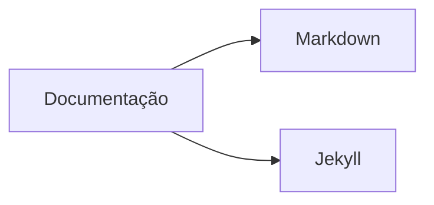

# Documentação

Materiais utilizados para aprender, criar e manter a documentação do **Infra Linux**.

Esta seção reúne conhecimentos sobre **Markdown**, **Jekyll** e outras ferramentas relacionadas à construção da documentação.

---

## [Markdown](index.md)

Documentação sobre a linguagem de marcação utilizada para escrever os conteúdos do Infra Linux.

### Conteúdos

1. [Markdown — Guia Completo](markdown.md)
2. [Markdown — Blocos de Código](markdown-bloco-de-codigos.md)
3. [Markdown — Tabelas](markdown-tabelas.md)
4. [Markdown — Links e Imagens](markdown-links-imagens.md)
5. [Markdown — Listas](markdown-listas.md)

---

## [Jekyll](index.md)

Documentação sobre o gerador de sites estáticos utilizado pelo Infra Linux.

### Conteúdos

1. [Jekyll — Guia Completo](jekyll.md)
2. [Jekyll — Layouts](jekyll-layouts.md)
3. [Jekyll — Liquid](jekyll-liquid.md)
4. [Jekyll — Includes](jekyll-includes.md)
5. [Jekyll — Collections](jekyll-collections.md)
6. [Jekyll — GitHub Pages](jekyll-github-pages.md)

---

## Estrutura

Visão geral das duas frentes de estudo desta documentação. O detalhamento de cada item está nas listas de **Conteúdos** acima.

---

## Objetivo

O objetivo desta seção é servir como material de estudo e também como referência rápida durante a manutenção do site.

| Ferramenta | Papel |
|---|---|
| **Markdown** | escreve o conteúdo |
| **Jekyll** | transforma o conteúdo em páginas |
| **Liquid** | adiciona lógica e dinamismo aos templates |
| **HTML/CSS/JavaScript** | formam e personalizam a interface |
| **GitHub Pages** | publica o site |

---

### Documentação em construção

Novos conteúdos serão adicionados conforme o desenvolvimento do Infra Linux.