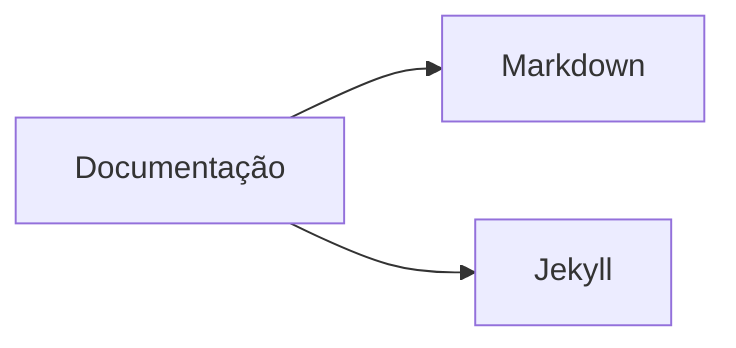

# Documentação

Materiais utilizados para aprender, criar e manter a documentação do **Pangolim**.

Esta seção reúne conhecimentos sobre **Markdown**, **Jekyll** e outras ferramentas relacionadas à construção da documentação.

---

## [Markdown](index.md)

Documentação sobre a linguagem de marcação utilizada para escrever os conteúdos do Pangolim.

### Conteúdos

  
Markdown

  <ul>
    <li><a href="{{ 'devops/documentacao/markdown.html' | relative_url }}">Guia Completo</a></li>
    <li><a href="{{ 'devops/documentacao/markdonw-bloco-de-codigos.html' | relative_url }}">Bloco de Código</a></li>
    <li><a href="{{ 'devops/documentacao/markdown-tabelas.html' | relative_url }}">Tabelas</a></li>
    <li><a href="{{ 'devops/documentacao/markdown-links-imagens.html' | relative_url }}">Links e Imagens</a></li>
    <li><a href="{{ 'devops/documentacao/markdown-listas.html' | relative_url }}">Listas</a></li>
  </ul>

---

## [Jekyll](index.md)

Documentação sobre o gerador de sites estáticos utilizado pelo Pangolim.

### Conteúdos

  
Jekyll

  <ul>
    <li><a href="{{ 'devops/documentacao/jekyll.html' | relative_url }}">Guia Completo</a></li>
    <li><a href="{{ 'devops/documentacao/jekyll-layouts.html' | relative_url }}">Layouts</a></li>
    <li><a href="{{ 'devops/documentacao/jekyll-liquid.html' | relative_url }}">Liquid</a></li>
    <li><a href="{{ 'devops/documentacao/jekyll-include.html' | relative_url }}">Includes</a></li>
    <li><a href="{{ 'devops/documentacao/jekyll-collections.html' | relative_url }}">Collections</a></li>
    <li><a href="{{ 'devops/documentacao/jekyll-github-pages.html' | relative_url }}">GitHub Pages</a></li>
  </ul>

---

## Estrutura

Visão geral das duas frentes de estudo desta documentação. O detalhamento de cada item está nas listas de **Conteúdos** acima.

```mermaid
flowchart LR
    Documentação --> Markdown
    Documentação --> Jekyll
```

---

## Objetivo

O objetivo desta seção é servir como material de estudo e também como referência rápida durante a manutenção do site.

| Ferramenta | Papel |
|---|---|
| **Markdown** | escreve o conteúdo |
| **Jekyll** | transforma o conteúdo em páginas |
| **Liquid** | adiciona lógica e dinamismo aos templates |
| **HTML/CSS/JavaScript** | formam e personalizam a interface |
| **GitHub Pages** | publica o site |

---

### Documentação em construção

Novos conteúdos serão adicionados conforme o desenvolvimento do Pangolim.