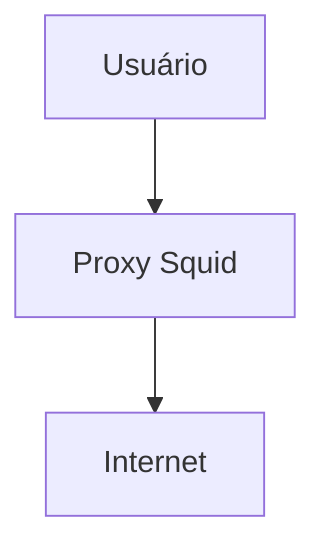
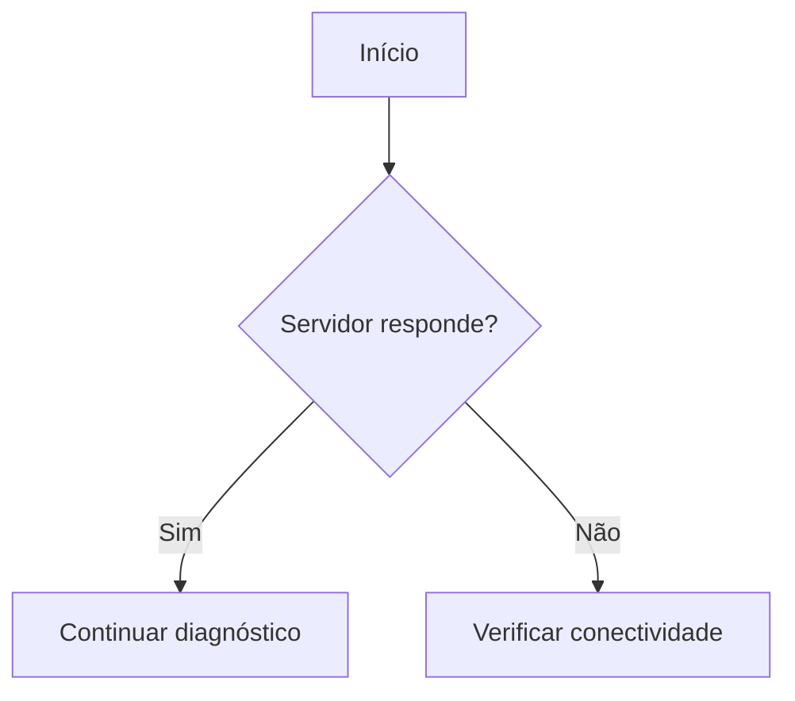
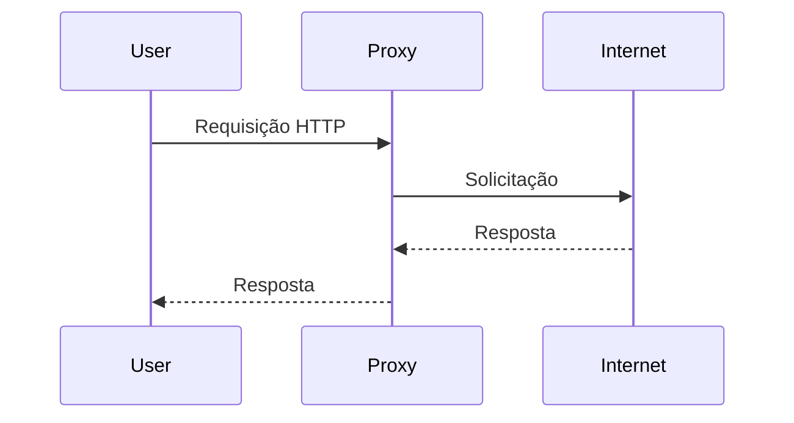

# Guia Prático de Markdown
## Índice

- [1. O que é Markdown?](#1-o-que-é-markdown)
- [2. Parágrafos e quebras de linha](#2-parágrafos-e-quebras-de-linha)
- [3. Títulos](#3-títulos)
- [4. Ênfase: negrito, itálico e riscado](#4-ênfase-negrito-itálico-e-riscado)
- [5. Código dentro de uma linha](#5-código-dentro-de-uma-linha)
- [6. Blocos de código](#6-blocos-de-código)
  - [6.1 Principais identificadores de linguagem](#61-principais-identificadores-de-linguagem)
  - [6.2 bash x text](#62-bash-x-text)
  - [6.3 Exemplos por linguagem](#63-exemplos-por-linguagem)
  - [6.4 Boas práticas em blocos de código](#64-boas-práticas-em-blocos-de-código)
- [7. Listas](#7-listas)
  - [7.1 Lista não ordenada](#71-lista-não-ordenada)
  - [7.2 Lista numerada](#72-lista-numerada)
  - [7.3 Listas aninhadas](#73-listas-aninhadas)
  - [7.4 Listas com blocos de código](#74-listas-com-blocos-de-código)
  - [7.5 Checklists](#75-checklists)
- [8. Links](#8-links)
  - [8.1 Sintaxe básica](#81-sintaxe-básica)
  - [8.2 Links entre páginas do mesmo projeto](#82-links-entre-páginas-do-mesmo-projeto)
  - [8.3 Âncoras (links internos na mesma página)](#83-âncoras-links-internos-na-mesma-página)
  - [8.4 Links de referência](#84-links-de-referência)
  - [8.5 Links automáticos](#85-links-automáticos)
- [9. Imagens](#9-imagens)
- [10. Tabelas](#10-tabelas)
  - [10.1 Alinhamento](#101-alinhamento)
  - [10.2 Cuidados](#102-cuidados)
- [11. Citações](#11-citações)
- [12. Linha horizontal](#12-linha-horizontal)
- [13. Escape de caracteres](#13-escape-de-caracteres)
- [14. Mostrando Markdown dentro de Markdown](#14-mostrando-markdown-dentro-de-markdown)
- [15. Avisos e observações](#15-avisos-e-observações)
  - [15.1 Citação com rótulo (funciona em qualquer lugar)](#151-citação-com-rótulo-funciona-em-qualquer-lugar)
  - [15.2 Alertas do GitHub](#152-alertas-do-github)
  - [15.3 Citação com classe CSS (kramdown/Jekyll)](#153-citação-com-classe-css-kramdownjekyll)
- [16. HTML, comentários e emojis](#16-html-comentários-e-emojis)
  - [16.1 HTML dentro do Markdown](#161-html-dentro-do-markdown)
  - [16.2 Comentários](#162-comentários)
  - [16.3 Emojis](#163-emojis)
- [17. Compatibilidade: GitHub x GitHub Pages/Jekyll](#17-compatibilidade-github-x-github-pagesjekyll)
- [18. Diagramas com Mermaid](#18-diagramas-com-mermaid)
- [19. Boas práticas de documentação técnica](#19-boas-práticas-de-documentação-técnica)
  - [19.1 Estrutura recomendada](#191-estrutura-recomendada)
  - [19.2 Não coloque tudo em um único bloco de código](#192-não-coloque-tudo-em-um-único-bloco-de-código)
  - [19.3 Perguntas que uma boa página responde](#193-perguntas-que-uma-boa-página-responde)
  - [19.4 Checklist de qualidade](#194-checklist-de-qualidade)
- [20. Exemplo completo de página técnica](#20-exemplo-completo-de-página-técnica)
- [21. Referência rápida](#21-referência-rápida)
- [22. Exercício prático](#22-exercício-prático)

Este guia reúne a sintaxe de Markdown que você realmente usa em documentação técnica, com exemplos prontos para copiar e observações sobre o que **funciona no GitHub** e o que **funciona no GitHub Pages/Jekyll**.

**Como estudar:** em cada seção há o código-fonte (o que você digita) e, quando possível, o resultado. Reproduza os exemplos em um arquivo `.md` de teste.

---

## 1. O que é Markdown?

Markdown é uma linguagem de marcação simples que formata texto usando caracteres comuns (`#`, `*`, `-`, `` ` ``). O arquivo é legível mesmo sem ser renderizado, e é convertido em HTML por um *processador*.

Onde é usado:

- GitHub e GitLab (`README.md`, issues, pull requests, wikis)
- Documentação de projetos e documentação técnica
- Sites estáticos (Jekyll, GitHub Pages) e blogs
- Editores e notas (VS Code, Obsidian)

A extensão padrão é `.md`:

```text
README.md
```

---

## 2. Parágrafos e quebras de linha

Para criar um novo parágrafo, deixe **uma linha em branco**:

```markdown
Este é o primeiro parágrafo.

Este é o segundo parágrafo.
```

Uma quebra de linha simples (sem linha em branco) normalmente **não** gera uma nova linha visual. Para forçar a quebra, termine a linha com **dois espaços** ou com uma barra invertida `\`:

```markdown
Linha 1\
Linha 2
```

> **Dica:** dois espaços no fim da linha são invisíveis e o editor pode removê-los sem avisar. Prefira a barra invertida ou, melhor ainda, use parágrafos separados.

---

## 3. Títulos

Os títulos usam `#`. A quantidade de `#` define o nível:

```markdown
# Título 1
## Título 2
### Título 3
#### Título 4
##### Título 5
###### Título 6
```

Regras de boa prática:

- Use **um único `#` (H1) por página**, para o título do documento.
- Não pule níveis (de `##` direto para `####`).
- Deixe uma linha em branco antes e depois do título.
- Mantenha títulos curtos e descritivos; eles viram o índice e as âncoras da página.

Exemplo de estrutura:

```markdown
# Ansible

## Introdução

## Inventários

### Inventário estático

### Inventário dinâmico

## Playbooks

## Troubleshooting
```

---

## 4. Ênfase: negrito, itálico e riscado

| Efeito | Sintaxe | Resultado |
|---|---|---|
| Negrito | `**texto**` | **texto** |
| Itálico | `*texto*` | *texto* |
| Negrito + itálico | `***texto***` | ***texto*** |
| Riscado | `~~texto~~` | ~~texto~~ |

Também funcionam `__negrito__` e `_itálico_`, mas o padrão com asteriscos é o mais comum e o mais seguro (o underscore pode falhar no meio de palavras, como em `nome_do_arquivo`).

---

## 5. Código dentro de uma linha

Use uma crase para destacar comandos, arquivos, diretórios, variáveis, serviços e pacotes:

```markdown
Execute o comando `systemctl status squid`.
O arquivo de configuração é `/etc/squid/squid.conf`.
```

Resultado: execute o comando `systemctl status squid`. O arquivo de configuração é `/etc/squid/squid.conf`.

Para mostrar uma crase **dentro** do código inline, use duas crases como delimitador, com espaços:

```markdown
`` `código` ``
```

---

## 6. Blocos de código

Um bloco de código é delimitado por três crases. Logo após as crases de abertura, informe a **linguagem** para ativar o *syntax highlighting*:

````markdown
```bash
systemctl status squid
```
````

Resultado:

```bash
systemctl status squid
```

### 6.1 Principais identificadores de linguagem

O suporte depende do processador (GitHub, Jekyll, VS Code etc.). Os mais comuns:

| Identificador | Uso |
|---|---|
| `bash`, `sh`, `shell` | Comandos de shell |
| `console`, `shell-session` | Sessão de terminal com prompt e saída |
| `text`, `plaintext` | Texto puro, sem destaque |
| `yaml` (ou `yml`) | YAML (Ansible, Kubernetes) |
| `json` | JSON |
| `ini` | Inventários e arquivos de configuração INI |
| `conf` | Arquivos de configuração genéricos |
| `xml`, `html`, `css` | XML, HTML e CSS |
| `javascript` (`js`), `typescript` (`ts`) | JavaScript e TypeScript |
| `python` (`py`) | Python |
| `java`, `c`, `cpp`, `csharp`, `go`, `rust`, `ruby`, `php` | Linguagens de programação |
| `sql` | SQL |
| `powershell` | PowerShell |
| `dockerfile` | Dockerfile |
| `diff` | Diferenças entre versões |
| `markdown` (`md`) | Markdown |
| `mermaid` | Diagramas (precisa de suporte da plataforma) |

### 6.2 `bash` x `text`

Esta diferença é essencial em documentação de infraestrutura:

- **`bash`** para o que o leitor **digita** (comandos).
- **`text`** para o que o terminal **responde** (saídas).

````markdown
Execute:

```bash
hostname
```

Resultado:

```text
s-sesu2772.infraero.gov.br
```
````

Assim o leitor sabe o que copiar e o que apenas conferir.

### 6.3 Exemplos por linguagem

**YAML (Ansible):**

```yaml
---
- name: Testar servidores
  hosts: squid
  tasks:
    - name: Verificar hostname
      ansible.builtin.command: hostname
```

**INI (inventário):**

```ini
[squid]
10.0.27.72
10.0.27.73
10.0.27.75
```

**JSON:**

```json
{
  "servidor": "s-sesu2772",
  "ip": "10.0.27.72"
}
```

**Dockerfile:**

```dockerfile
FROM nginx:latest
COPY index.html /usr/share/nginx/html/
```

**SQL:**

```sql
SELECT *
FROM servidores
WHERE ativo = true;
```

**PowerShell:**

```powershell
Get-Service -Name Spooler
```

**Diff** (excelente para registrar mudanças; `-` aparece em vermelho e `+` em verde):

```diff
- proxy=10.0.27.71
+ proxy=10.0.27.72
```

### 6.4 Boas práticas em blocos de código

Comente os comandos:

```bash
# Verificar status do Squid
systemctl status squid

# Verificar versão
squid -v
```

Divida comandos longos com `\`, em vez de uma linha enorme:

```bash
ansible-playbook \
  -i /opt/ansible/squid/inventory/proxy_squid \
  /opt/ansible/squid/playbooks/squid_url_manager.yml \
  -e "url=.teste-ansible.infraero.local" \
  -e "acao=liberar"
```

Para mostrar uma sessão com prompt e saída no mesmo bloco, use `text` ou `console`:

```text
[root@s-sesu2772 ~]# systemctl is-active squid
active
```

> **Atenção:** não copie o prompt (`[root@...]#`) para blocos `bash`. Se o leitor copiar e colar, o comando quebra.

---

## 7. Listas

### 7.1 Lista não ordenada

Use `-` (também aceitam `*` e `+`; escolha um e mantenha em todo o documento):

```markdown
- Linux
- Ansible
- Docker
- Kubernetes
```

- Linux
- Ansible
- Docker
- Kubernetes

### 7.2 Lista numerada

```markdown
1. Instalar o Ansible
2. Criar o inventário
3. Criar o playbook
4. Executar o playbook
5. Validar o resultado
```

1. Instalar o Ansible
2. Criar o inventário
3. Criar o playbook
4. Executar o playbook
5. Validar o resultado

Os números reais não importam: `1.` repetido em todas as linhas também gera a sequência correta, o que facilita reordenar itens.

### 7.3 Listas aninhadas

Indente com **2 ou 4 espaços** (seja consistente):

```markdown
- Ansible
  - Inventários
  - Playbooks
  - Módulos
```

- Ansible
  - Inventários
  - Playbooks
  - Módulos

### 7.4 Listas com blocos de código

Para manter um bloco de código dentro de um item numerado, **indente o bloco** alinhado ao texto do item:

````markdown
1. Instale o pacote:

   ```bash
   dnf install squid
   ```

2. Habilite o serviço:

   ```bash
   systemctl enable --now squid
   ```
````

### 7.5 Checklists

```markdown
- [ ] Verificar espaço em disco
- [ ] Verificar serviço Squid
- [x] Testar conexão
```

Ótimas para procedimentos operacionais. **Atenção:** o GitHub renderiza caixinhas clicáveis, mas o Jekyll padrão (kramdown) mostra apenas o texto `[ ]`/`[x]`. Veja a [seção 17](#17-compatibilidade-github-x-github-pagesjekyll).

---

## 8. Links

### 8.1 Sintaxe básica

```markdown
[texto do link](https://github.com)
[texto com título](https://github.com "Título ao passar o mouse")
```

### 8.2 Links entre páginas do mesmo projeto

Em um site Jekyll/GitHub Pages, use caminhos relativos ao site:

```markdown
[Inventários](inventarios.html)
[Playbooks](/playbooks/)
```

Se o site estiver em um subcaminho (`usuario.github.io/infra-linux/`), links que começam com `/` podem quebrar. Nesse caso, o Jekyll oferece o filtro `relative_url`, que será tratado no guia de Jekyll/Liquid.

### 8.3 Âncoras (links internos na mesma página)

Cada título recebe um identificador automático. Linke para ele com `#`:

```markdown
[Ir para instalação](#instalação)
```

As regras de geração (acentos, maiúsculas, espaços) **variam entre plataformas**. Regra geral: minúsculas, espaços viram `-`. **Teste sempre no seu site**, principalmente com títulos acentuados.

### 8.4 Links de referência

Úteis quando o mesmo link aparece várias vezes:

```markdown
Consulte a [documentação][doc] e o [guia][doc].

[doc]: https://docs.ansible.com
```

### 8.5 Links automáticos

```markdown
<https://exemplo.com>
```

---

## 9. Imagens

```markdown

```

O texto entre `[]` é o **texto alternativo** (acessibilidade e fallback se a imagem não carregar). Descreva o que a imagem mostra, sem escrever apenas "imagem".

Imagem clicável (imagem dentro de um link):

```markdown
[](https://exemplo.com)
```

Dicas:

- Guarde as imagens em uma pasta padrão (`img/` ou `assets/img/`).
- Use nomes sem espaços nem acentos: `arquitetura-squid.png`.
- Markdown puro não controla o tamanho da imagem; para isso é necessário HTML (``) ou CSS.

---

## 10. Tabelas

```markdown
| Servidor | IP | Sistema |
|---|---|---|
| Proxy 01 | 10.0.27.72 | Rocky Linux |
| Proxy 02 | 10.0.27.73 | Rocky Linux |
| Proxy 03 | 10.0.27.75 | Rocky Linux |
```

| Servidor | IP | Sistema |
|---|---|---|
| Proxy 01 | 10.0.27.72 | Rocky Linux |
| Proxy 02 | 10.0.27.73 | Rocky Linux |
| Proxy 03 | 10.0.27.75 | Rocky Linux |

### 10.1 Alinhamento

```markdown
| Esquerda | Centro | Direita |
|:---|:---:|---:|
| A | B | C |
```

| Esquerda | Centro | Direita |
|:---|:---:|---:|
| A | B | C |
| D | E | F |

```text
:---    esquerda
:---:   centro
---:    direita
```

### 10.2 Cuidados

- A linha separadora (`|---|---|`) é obrigatória.
- Para usar o caractere `|` dentro de uma célula, escape-o: `\|`.
- Não é possível colocar blocos de código de várias linhas ou listas dentro de tabelas; use `<br>` ou reorganize o conteúdo.
- Tabelas muito largas ficam ruins em telas pequenas; prefira poucas colunas.

---

## 11. Citações

```markdown
> Esta é uma citação.
>
> Pode ter vários parágrafos.
```

> Esta é uma citação.
>
> Pode ter vários parágrafos.

Citações aninhadas:

```markdown
> Nível 1
>> Nível 2
```

Em documentação técnica, citações são frequentemente usadas para **observações e avisos** (veja a seção 15).

---

## 12. Linha horizontal

```markdown
---
```

Também funcionam `***` e `___`. Deixe sempre uma **linha em branco antes** de `---`: logo abaixo de um texto, ele pode ser interpretado como título (H2).

---

## 13. Escape de caracteres

Para mostrar literalmente um caractere que tem significado especial, use a barra invertida:

```markdown
\*não é itálico\*
```

\*não é itálico\*

Caracteres que podem precisar de escape:

```text
\  `  *  _  {  }  [  ]  (  )  #  +  -  .  !  |
```

Na prática, você só precisa do escape quando o caractere está no início de uma linha ou cercado por texto que o faria ser interpretado. Dentro de código inline ou de blocos de código, o escape **não** é necessário.

---

## 14. Mostrando Markdown dentro de Markdown

Para exibir um bloco de código que **contém** crases, o delimitador externo precisa ter **mais crases** que o conteúdo interno.

Mostrar um bloco `bash` (delimitador externo de 4 crases):

`````markdown
````markdown
```bash
hostname
```
````
`````

A regra: se o conteúdo tem três crases, use quatro (ou mais) para envolvê-lo. Isso é indispensável quando você cria **documentação sobre Markdown**, como este guia.

---

## 15. Avisos e observações

Markdown puro não tem caixas de aviso. Há três abordagens; use a que seu site suportar.

### 15.1 Citação com rótulo (funciona em qualquer lugar)

```markdown
> **Atenção:** faça backup antes de alterar o arquivo.
```

> **Atenção:** faça backup antes de alterar o arquivo.

### 15.2 Alertas do GitHub

No GitHub (README, issues, wikis):

```markdown
> [!NOTE]
> Informação útil.

> [!TIP]
> Dica para facilitar o trabalho.

> [!IMPORTANT]
> Informação essencial.

> [!WARNING]
> Cuidado ao executar este comando.

> [!CAUTION]
> Pode causar perda de dados.
```

**No GitHub Pages/Jekyll esta sintaxe não é interpretada**: aparece como uma citação comum com o texto `[!NOTE]`.

### 15.3 Citação com classe CSS (kramdown/Jekyll)

O kramdown permite anexar uma classe a um bloco com `{: .classe }` logo **após** o bloco:

```markdown
> **Atenção:** faça backup antes de alterar o arquivo.
{: .warning }
```

Depois você define `.warning` no CSS do site (borda colorida, fundo etc.). É a forma mais comum de criar caixas de aviso no GitHub Pages, e será detalhada no guia de Jekyll.

---

## 16. HTML, comentários e emojis

### 16.1 HTML dentro do Markdown

A maioria dos processadores aceita HTML:

```html
<b>Texto em negrito</b>
Linha 1<br>Linha 2
```

Use HTML somente quando o Markdown não resolver (tamanho de imagem, alinhamento, recolher conteúdo):

```html
<details>
<summary>Clique para ver a saída completa</summary>

Conteúdo escondido, com **Markdown** funcionando (note a linha em branco acima).

</details>
```

### 16.2 Comentários

Não existe sintaxe própria de comentário, mas o HTML resolve:

```html
<!-- Este comentário não aparece na página -->
```

> **Cuidado:** o comentário some da página, mas continua no código-fonte HTML que o navegador recebe. Não coloque senhas, IPs internos ou dados sensíveis.

### 16.3 Emojis

O GitHub aceita *shortcodes*:

```markdown
:warning: Atenção!  :white_check_mark: OK  :x: Erro
```

No GitHub Pages, os shortcodes só funcionam com o plugin `jemoji`. Sem ele, você pode colar o emoji diretamente (⚠️ ✅ ❌). Em documentação técnica, use com moderação.

---

## 17. Compatibilidade: GitHub x GitHub Pages/Jekyll

Markdown **não é uma única linguagem**. Existem várias implementações:

- **CommonMark** (especificação padronizada);
- **GitHub Flavored Markdown (GFM)**, usado no github.com: adiciona tabelas, checklists, riscado, autolinks e alertas;
- **kramdown**, o processador padrão do Jekyll/GitHub Pages;
- variações do GitLab, Obsidian e de vários editores.

Resumo do que esperar (confirme no seu site, pois depende do tema e da configuração):

| Recurso | GitHub | GitHub Pages (Jekyll padrão) |
|---|:---:|:---:|
| Títulos, negrito, itálico, listas, links, imagens | ✅ | ✅ |
| Tabelas | ✅ | ✅ |
| Blocos de código com linguagem | ✅ | ✅ |
| Riscado `~~texto~~` | ✅ | ✅ |
| Checklists `- [ ]` clicáveis | ✅ | ❌ (aparece como texto) |
| Alertas `> [!NOTE]` | ✅ | ❌ |
| Mermaid | ✅ | ❌ (requer adicionar o script) |
| Emojis `:warning:` | ✅ | ⚠️ (só com `jemoji`) |
| Classes com `{: .classe }` | ❌ | ✅ (kramdown) |
| Liquid (``, `{{ }}`) | ❌ | ✅ |

**Consequência prática:** o mesmo `.md` pode ficar bonito no repositório e diferente no site. Sempre valide no destino final.

---

## 18. Diagramas com Mermaid

Mermaid transforma texto em diagramas. É ótimo para infraestrutura, mas exige suporte da plataforma: no GitHub funciona direto; no GitHub Pages é preciso incluir a biblioteca Mermaid no layout do site (tema do guia de Jekyll).

**Diagrama simples:**

````markdown

````

**Fluxograma de troubleshooting:**

````markdown

````

**Diagrama de sequência:**

````markdown

````

---

## 19. Boas práticas de documentação técnica

### 19.1 Estrutura recomendada

````markdown
# Nome da tecnologia

## Introdução
O que é e para que serve.

## Pré-requisitos
- Linux
- Python
- Ansible

## Instalação
Comandos necessários.

## Configuração
Arquivos e parâmetros.

## Utilização
Comandos principais.

## Exemplos
Casos práticos.

## Verificação
Como confirmar que funcionou.

## Troubleshooting
Problemas comuns e soluções.

## Referências
Links oficiais.
````

### 19.2 Não coloque tudo em um único bloco de código

Ruim:

````markdown
```text
Verifique o serviço Squid.
Depois verifique a versão.
Por último consulte os logs.
systemctl is-active squid
squid -v
tail -f /var/log/squid/access.log
```
````

Bom: texto explicativo, seguido de um bloco por comando.

````markdown
## Verificação

Verifique se o serviço está ativo:

```bash
systemctl is-active squid
```

Verifique a versão:

```bash
squid -v
```

Consulte os logs:

```bash
tail -f /var/log/squid/access.log
```
````

Cada comando fica isolado, copiável e fácil de manter.

### 19.3 Perguntas que uma boa página responde

1. O que é?
2. Para que serve?
3. O que preciso antes de começar?
4. Como instalar?
5. Como configurar?
6. Como utilizar?
7. Como verificar se funcionou?
8. Como resolver problemas?
9. Onde encontrar mais informações?

Fluxo mental para documentação de infraestrutura:

```text
Conceito → Instalação → Configuração → Execução → Validação → Troubleshooting
```

Funciona para Linux, Ansible, Docker, Kubernetes, Git, Squid, Zabbix, Nginx, Apache, Jenkins e outras tecnologias.

### 19.4 Checklist de qualidade

- [ ] Um único H1 e níveis de título sem saltos
- [ ] Linguagem informada em todos os blocos de código
- [ ] `bash` para comandos e `text` para saídas
- [ ] Nenhuma senha, token ou dado sensível no texto ou em comentários HTML
- [ ] Imagens com texto alternativo
- [ ] Links internos testados no site publicado
- [ ] Página conferida no GitHub **e** no GitHub Pages

---

## 20. Exemplo completo de página técnica

````markdown
# Squid

## Introdução

O Squid é utilizado como proxy HTTP/HTTPS.

## Servidores

| Servidor | IP | Função |
|---|---|---|
| Proxy 01 | 10.0.27.72 | Squid |
| Proxy 02 | 10.0.27.73 | Squid |
| Proxy 03 | 10.0.27.75 | Squid |

## Verificação

Verifique o serviço:

```bash
systemctl status squid
```

Resultado esperado:

```text
Active: active (running)
```

> **Atenção:** faça backup do `squid.conf` antes de alterá-lo.
{: .warning }

## Troubleshooting

Consulte a página de [troubleshooting](troubleshooting.html).
````

---

## 21. Referência rápida

| Objetivo | Sintaxe |
|---|---|
| Título | `# Título` |
| Subtítulo | `## Subtítulo` |
| Negrito | `**texto**` |
| Itálico | `*texto*` |
| Riscado | `~~texto~~` |
| Código inline | `` `código` `` |
| Bloco de código | ` ```bash ` ... ` ``` ` |
| Lista | `- item` |
| Lista numerada | `1. item` |
| Checklist | `- [ ] item` |
| Link | `[texto](URL)` |
| Imagem | `` |
| Citação | `> texto` |
| Linha horizontal | `---` |
| Tabela | `\| A \| B \|` |
| Escape | `\*` |
| Comentário | `<!-- comentário -->` |
| Diagrama | ` ```mermaid ` |
| Diff | ` ```diff ` |
| Classe kramdown | `{: .classe }` |

Resumo do que mais será usado no **Infra Linux**:

```text
#            Títulos
**           Negrito
`            Código inline
```bash      Comandos
```text      Saídas
```yaml      YAML
```ini       Configurações INI
```diff      Alterações
```mermaid   Diagramas
-  /  1.     Listas
|            Tabelas
>            Observações
[ ]( )       Links
      Imagens
```

---

## 22. Exercício prático

Crie um arquivo `teste.md` e reproduza uma página sobre um serviço que você administra, contendo:

1. Um título H1 e pelo menos três seções H2;
2. Uma tabela com servidores e IPs;
3. Um comando em bloco `bash` e sua saída em bloco `text`;
4. Uma lista numerada de procedimento com um bloco de código indentrado dentro de um item;
5. Um aviso em citação com rótulo;
6. Um link para outra página do site e uma âncora interna.

Publique no GitHub Pages e compare com a visualização do GitHub. As diferenças que encontrar são o melhor ponto de partida para o próximo guia: **Markdown profissional com Jekyll/Liquid**.