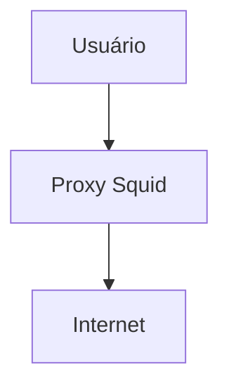
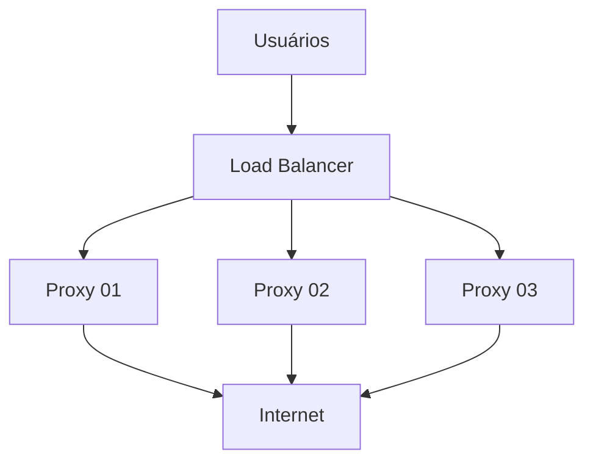
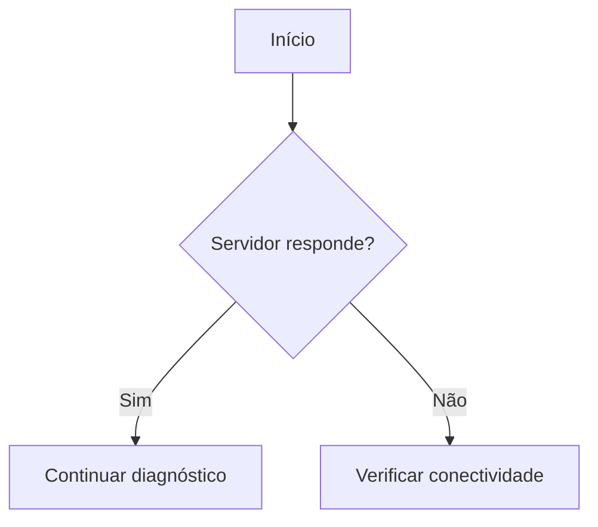
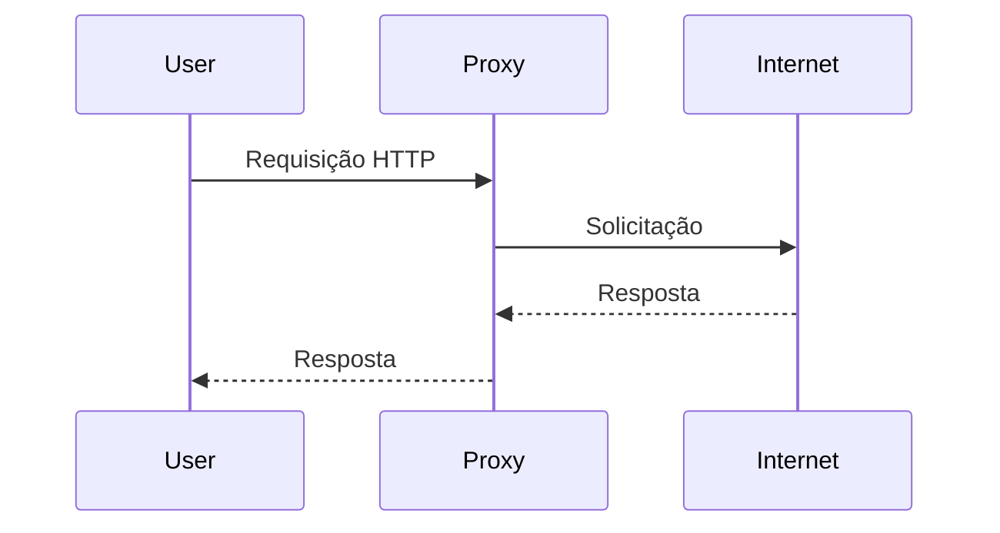

# Guia Completo de Markdown
{:.no_toc}

<div class="toc-title">Sumário</div>
* Sumário:
{:toc}



Este guia junta em um só material o *Guia Prático de Markdown* (a **sintaxe**) e o *Markdown para Documentação Profissional* (a **escrita técnica de qualidade**). Ele foi organizado para estudo, do básico ao avançado.

## Como usar este guia

**Trilha de estudo sugerida:**

| Parte | Assunto | Você aprende |
|---|---|---|
| **I** | Fundamentos | A sintaxe: títulos, ênfase, código, listas, links, imagens, tabelas |
| **II** | Recursos avançados e compatibilidade | Escape, HTML, avisos, Mermaid e as diferenças entre GitHub e Jekyll |
| **III** | Escrevendo documentação técnica | Como escrever bem, não apenas como digitar símbolos |
| **IV** | Modelos prontos | Páginas de troubleshooting, referência, README etc. |
| **V** | Organização, segurança e publicação | Arquivos, Git, dados sensíveis, Jekyll, manutenção |
| **VI** | Consolidação | Checklists, referência rápida, erros comuns, glossário, exercícios |

**Como estudar:** em cada seção há o código-fonte (o que você digita) e, quando possível, o resultado. **Reproduza todos os exemplos** em um arquivo `.md` de teste. Ler não basta: a sintaxe fixa quando você digita e vê o resultado.

**Convenções deste guia:**

- Blocos `markdown` mostram o **código-fonte**.
- O que vem logo depois, sem bloco, é o **resultado renderizado**.
- Os endereços IP, hostnames e domínios dos exemplos são **fictícios** (faixa `192.0.2.0/24`, reservada para documentação, e domínio `exemplo.local`). Veja o motivo na seção 41.

---

# PARTE I: FUNDAMENTOS

## 1. O que é Markdown?

Markdown é uma linguagem de marcação simples que formata texto usando caracteres comuns (`#`, `*`, `-`, `` ` ``). O arquivo é legível mesmo sem ser renderizado, e é convertido em HTML por um *processador*.

**Onde é usado:**

- GitHub e GitLab (`README.md`, issues, pull requests, wikis)
- Documentação de projetos e documentação técnica
- Sites estáticos (Jekyll, GitHub Pages) e blogs
- Editores e notas (VS Code, Obsidian)

A extensão padrão é `.md`:

```text
README.md
```

**Fluxo básico:**

```text
texto com marcações (.md) → processador → HTML → navegador
```

> **Em resumo:** você escreve texto puro com símbolos simples; um programa converte em página formatada.

---

## 2. Parágrafos e quebras de linha

Para criar um novo parágrafo, deixe **uma linha em branco**:

```markdown
Este é o primeiro parágrafo.

Este é o segundo parágrafo.
```

Uma quebra de linha simples (sem linha em branco) normalmente **não** gera uma nova linha visual. Para forçar a quebra, termine a linha com **dois espaços** ou com uma barra invertida `\`:

```markdown
Linha 1\
Linha 2
```

> **Dica:** dois espaços no fim da linha são invisíveis e o editor pode removê-los sem avisar. Prefira a barra invertida ou, melhor ainda, use parágrafos separados.

---

## 3. Títulos

Os títulos usam `#`. A quantidade de `#` define o nível:

```markdown
# Título 1
## Título 2
### Título 3
#### Título 4
##### Título 5
###### Título 6
```

**Regras de boa prática:**

- Use **um único `#` (H1) por página**, para o título do documento.
- **Não pule níveis** (de `##` direto para `####`).
- Deixe uma linha em branco antes e depois do título.
- Mantenha títulos **curtos e descritivos**: "Validação", não "Agora vamos validar se tudo funcionou". Eles viram o índice e as âncoras da página.
- Prefira títulos **únicos** na página: títulos repetidos geram âncoras duplicadas.
- Em páginas de procedimento, títulos que indicam ação ("Recarregar o serviço") ajudam na leitura.

**Exemplo de estrutura bem hierarquizada:**

```markdown
# Ansible

## Introdução

## Inventários

### Inventário estático

### Inventário dinâmico

## Playbooks

### Estrutura

### Variáveis

## Troubleshooting
```

---

## 4. Ênfase: negrito, itálico e riscado

| Efeito | Sintaxe | Resultado |
|---|---|---|
| Negrito | `**texto**` | **texto** |
| Itálico | `*texto*` | *texto* |
| Negrito + itálico | `***texto***` | ***texto*** |
| Riscado | `~~texto~~` | ~~texto~~ |

Também funcionam `__negrito__` e `_itálico_`, mas o padrão com asteriscos é o mais comum e o mais seguro: o underscore pode falhar no meio de palavras, como em `nome_do_arquivo`.

---

## 5. Código dentro de uma linha

Use uma crase para destacar **comandos, arquivos, diretórios, variáveis, serviços e pacotes**:

```markdown
Execute o comando `systemctl status squid`.
O arquivo de configuração é `/etc/squid/squid.conf`.
```

Resultado: execute o comando `systemctl status squid`. O arquivo de configuração é `/etc/squid/squid.conf`.

Para mostrar uma crase **dentro** do código inline, use duas crases como delimitador, com espaços:

```markdown
`` `código` ``
```

---

## 6. Blocos de código

Um bloco de código é delimitado por **três crases**. Logo após as crases de abertura, informe a **linguagem** para ativar o *syntax highlighting* (coloração da sintaxe):

````markdown
```bash
systemctl status squid
```
````

Resultado:

```bash
systemctl status squid
```

### 6.1 Principais identificadores de linguagem

O suporte depende do processador (GitHub, Jekyll, VS Code etc.). Os mais comuns:

| Identificador | Uso |
|---|---|
| `bash`, `sh`, `shell` | Comandos de shell |
| `console`, `shell-session` | Sessão de terminal com prompt e saída |
| `text`, `plaintext` | Texto puro, sem destaque |
| `yaml` (ou `yml`) | YAML (Ansible, Kubernetes) |
| `json` | JSON |
| `ini` | Inventários e arquivos de configuração INI |
| `conf` | Arquivos de configuração genéricos |
| `xml`, `html`, `css` | XML, HTML e CSS |
| `javascript` (`js`), `typescript` (`ts`) | JavaScript e TypeScript |
| `python` (`py`) | Python |
| `java`, `c`, `cpp`, `csharp`, `go`, `rust`, `ruby`, `php` | Linguagens de programação |
| `sql` | SQL |
| `powershell` | PowerShell |
| `dockerfile` | Dockerfile |
| `diff` | Diferenças entre versões |
| `markdown` (`md`) | Markdown |
| `mermaid` | Diagramas (precisa de suporte da plataforma) |

### 6.2 `bash` x `text`: a distinção mais importante

Esta diferença é essencial em documentação de infraestrutura:

- **`bash`** para o que o leitor **digita** (comandos).
- **`text`** para o que o terminal **responde** (saídas e logs).

````markdown
Execute:

```bash
hostname
```

Resultado:

```text
s-exemplo01.exemplo.local
```
````

Assim o leitor sabe o que copiar e o que apenas conferir.

### 6.3 Exemplos por linguagem

**YAML (Ansible):**

```yaml
---
- name: Testar servidores
  hosts: squid
  tasks:
    - name: Verificar hostname
      ansible.builtin.command: hostname
```

**INI (inventário):**

```ini
[squid]
192.0.2.72
192.0.2.73
192.0.2.75
```

**JSON:**

```json
{
  "servidor": "s-exemplo01",
  "ip": "192.0.2.72"
}
```

**Dockerfile:**

```dockerfile
FROM nginx:latest
COPY index.html /usr/share/nginx/html/
```

**SQL:**

```sql
SELECT *
FROM servidores
WHERE ativo = true;
```

**PowerShell:**

```powershell
Get-Service -Name Spooler
```

**Diff** (excelente para mostrar **antes e depois**; `-` aparece em vermelho e `+` em verde):

```diff
- http_port 8080
+ http_port 3128
```

### 6.4 Boas práticas em blocos de código

**Tudo que o leitor precisa copiar e executar vai em bloco de código.**

Ruim:

```markdown
Execute ansible squid -i squid.ini -m ping para verificar a conexão.
```

Bom:

````markdown
Execute o seguinte comando para verificar a conexão:

```bash
ansible squid -i squid.ini -m ping
```
````

**Comente os comandos:**

```bash
# Verificar status do Squid
systemctl status squid

# Verificar versão
squid -v
```

**Divida comandos longos com `\`**, em vez de uma linha enorme. Continua sendo uma única instrução:

```bash
ansible-playbook \
  -i /opt/ansible/squid/inventory/proxy_squid \
  /opt/ansible/squid/playbooks/squid_url_manager.yml \
  -e "url=.teste-ansible.exemplo.local" \
  -e "acao=liberar"
```

**Não copie o prompt.** Em blocos `bash`, escreva apenas o comando, sem `[root@servidor ~]#` nem `$`. Se precisar mostrar uma sessão completa (prompt + saída), use `text` ou `console`:

```text
[root@s-exemplo01 ~]# systemctl is-active squid
active
```

> **Atenção:** se o leitor copiar e colar um prompt de um bloco `bash`, o comando quebra.

**Use placeholders em maiúsculas** para o que o leitor precisa adaptar, e explique-os logo depois:

```bash
ssh USUARIO@IP_DO_SERVIDOR
```

```text
USUARIO         = usuário de acesso ao servidor
IP_DO_SERVIDOR  = endereço IP ou nome do servidor
```

Isso torna o documento reutilizável e evita expor dados reais.

**Não coloque tudo em um único bloco.** Ruim:

````markdown
```text
Verifique o serviço Squid.
Depois verifique a versão.
Por último consulte os logs.
systemctl is-active squid
squid -v
tail -f /var/log/squid/access.log
```
````

Bom: texto explicativo seguido de **um bloco por comando**:

````markdown
## Verificação

Verifique se o serviço está ativo:

```bash
systemctl is-active squid
```

Verifique a versão:

```bash
squid -v
```

Consulte os logs:

```bash
tail -f /var/log/squid/access.log
```
````

Cada comando fica isolado, copiável e fácil de manter.

---

## 7. Listas

### 7.1 Lista não ordenada

Use `-` (também aceitam `*` e `+`; **escolha um e mantenha em todo o documento**):

```markdown
- Linux
- Ansible
- Docker
- Kubernetes
```

- Linux
- Ansible
- Docker
- Kubernetes

### 7.2 Lista numerada

```markdown
1. Instalar o Ansible
2. Criar o inventário
3. Criar o playbook
4. Executar o playbook
5. Validar o resultado
```

1. Instalar o Ansible
2. Criar o inventário
3. Criar o playbook
4. Executar o playbook
5. Validar o resultado

Os números reais não importam: `1.` repetido em todas as linhas também gera a sequência correta, o que facilita reordenar itens.

### 7.3 Listas aninhadas

Indente com **2 ou 4 espaços** (seja consistente):

```markdown
- Ansible
  - Inventários
  - Playbooks
  - Módulos
```

- Ansible
  - Inventários
  - Playbooks
  - Módulos

### 7.4 Listas com blocos de código

Para manter um bloco de código **dentro** de um item numerado, **indente o bloco** alinhado ao texto do item. Sem a indentação, a lista é interrompida e a numeração recomeça em 1.

````markdown
1. Instale o pacote:

   ```bash
   dnf install squid
   ```

2. Habilite o serviço:

   ```bash
   systemctl enable --now squid
   ```
````

### 7.5 Checklists

```markdown
- [ ] Verificar espaço em disco
- [ ] Verificar serviço Squid
- [x] Testar conexão
```

Ótimas para procedimentos operacionais, validações e para registrar o que já foi feito:

```markdown
- [x] Backup realizado
- [x] Configuração alterada
- [x] Serviço reiniciado
```

> **Atenção:** o GitHub renderiza caixinhas clicáveis, mas o Jekyll padrão (kramdown) mostra apenas o texto `[ ]`/`[x]`. Veja a seção 17.

---

## 8. Links

### 8.1 Sintaxe básica

```markdown
[texto do link](https://github.com)
[texto com título](https://github.com "Título ao passar o mouse")
```

### 8.2 Escreva textos de link que façam sentido fora de contexto

| Ruim | Bom |
|---|---|
| Clique [aqui](inventarios.html) | Consulte [Inventários do Ansible](inventarios.html) |

Isso melhora a leitura e a acessibilidade (leitores de tela listam os links isoladamente).

### 8.3 Links entre páginas do mesmo projeto

Em um site Jekyll/GitHub Pages, use caminhos relativos ao site:

```markdown
[Inventários](inventarios.html)
[Playbooks](/playbooks/)
```

Se o site estiver em um subcaminho (`usuario.github.io/infra-linux/`), links que começam com `/` podem quebrar. O Jekyll oferece o filtro `relative_url` para isso, que é assunto do estudo de Jekyll/Liquid.

### 8.4 Links `.md` x `.html` no Jekyll (erro muito comum)

O Jekyll converte `inventarios.md` em `inventarios.html` (ou em `/inventarios/`, se o site usar *permalinks* amigáveis). Portanto:

- Um link para `inventarios.md` funciona **no GitHub** (navegando pelo repositório), mas pode dar **erro 404 no site publicado**.
- Um link para `inventarios.html` funciona **no site**, mas pode não funcionar ao navegar pelo repositório.

**Como resolver:**

1. Escolha **um padrão** e use-o em todas as páginas.
2. Prefira caminhos que o site publicado entende (`.html` ou o permalink configurado).
3. O Jekyll oferece formas mais robustas, como o plugin `jekyll-relative-links` e os recursos do Liquid para gerar URLs. Confira o que está habilitado no seu site.
4. **Teste os links no site publicado**, não apenas no editor.

### 8.5 Âncoras (links internos na mesma página)

Cada título recebe um identificador automático. Linke para ele com `#`:

```markdown
[Ir para Troubleshooting](#troubleshooting)
```

As regras de geração (acentos, maiúsculas, espaços) **variam entre plataformas**. Regra geral: minúsculas, espaços viram `-`. **Teste sempre no seu site**, principalmente com títulos acentuados.

### 8.6 Índice da página

Índices manuais quebram quando um título é renomeado:

```markdown
## Índice

- [Introdução](#introdução)
- [Instalação](#instalação)
- [Troubleshooting](#troubleshooting)
```

O kramdown (Jekyll) gera índice **automático** com esta marcação (é a que este guia usa no topo):

```markdown
* Sumário:
{:toc}
```

Para documentos pequenos, nenhum índice é necessário.

### 8.7 Links de referência

Úteis quando o mesmo link aparece várias vezes:

```markdown
Consulte a [documentação][doc] e o [guia][doc].

[doc]: https://docs.ansible.com
```

### 8.8 Links automáticos

```markdown
<https://exemplo.com>
```

---

## 9. Imagens

```markdown

```

O texto entre `[]` é o **texto alternativo** (acessibilidade e fallback se a imagem não carregar). Descreva **o que a imagem mostra**:

| Ruim | Bom |
|---|---|
| `` | `` |

**Imagem clicável** (imagem dentro de um link):

```markdown
[](https://exemplo.com)
```

**Dicas e cuidados:**

- Guarde as imagens em uma pasta padrão (`img/` ou `assets/img/`).
- Use nomes **sem espaços nem acentos**: `arquitetura-squid.png`.
- Markdown puro não controla o tamanho da imagem; para isso é necessário HTML (``) ou CSS.
- Use imagens quando elas realmente ajudam (arquitetura, telas, fluxos).
- **Comandos e saídas não devem ser imagens.** Texto é pesquisável e copiável.
- Antes de publicar, confira se os prints **não mostram** senhas, tokens, IPs sensíveis ou nomes de usuários.

---

## 10. Tabelas

```markdown
| Servidor | IP | Sistema |
|---|---|---|
| Proxy 01 | 192.0.2.72 | Rocky Linux |
| Proxy 02 | 192.0.2.73 | Rocky Linux |
| Proxy 03 | 192.0.2.75 | Rocky Linux |
```

| Servidor | IP | Sistema |
|---|---|---|
| Proxy 01 | 192.0.2.72 | Rocky Linux |
| Proxy 02 | 192.0.2.73 | Rocky Linux |
| Proxy 03 | 192.0.2.75 | Rocky Linux |

### 10.1 Alinhamento

```markdown
| Esquerda | Centro | Direita |
|:---|:---:|---:|
| A | B | C |
```

| Esquerda | Centro | Direita |
|:---|:---:|---:|
| A | B | C |
| D | E | F |

```text
:---    esquerda
:---:   centro
---:    direita
```

### 10.2 Cuidados técnicos

- A linha separadora (`|---|---|`) é **obrigatória**.
- Para usar o caractere `|` dentro de uma célula, escape-o: `\|`.
- Não é possível colocar blocos de código de várias linhas ou listas dentro de tabelas; use `<br>` ou reorganize o conteúdo.
- Tabelas muito largas ficam ruins em telas pequenas; prefira poucas colunas.

### 10.3 Quando usar (e quando não usar) tabelas

Use tabelas para **dados comparáveis**: servidores, portas, parâmetros, versões.

**Não use tabelas para texto longo ou layout.** Se a célula tem um parágrafo, use títulos.

Ruim:

```markdown
| Passo | Explicação |
|---|---|
| 1 | Texto muito grande, com vários comandos e observações... |
```

Melhor:

```markdown
### Passo 1: Fazer backup

Texto explicativo e comando.
```

Evite também guardar em tabelas informações que **mudam com frequência** (status atual, uso de CPU): elas ficam desatualizadas.

---

## 11. Citações

```markdown
> Esta é uma citação.
>
> Pode ter vários parágrafos.
```

> Esta é uma citação.
>
> Pode ter vários parágrafos.

Citações aninhadas:

```markdown
> Nível 1
>> Nível 2
```

Em documentação técnica, citações são frequentemente usadas para **observações e avisos** (seções 15 e 27).

---

## 12. Linha horizontal

```markdown
---
```

Também funcionam `***` e `___`. Deixe sempre uma **linha em branco antes** de `---`: logo abaixo de um texto, ele pode ser interpretado como título (H2).

---

## 13. Exercícios de fixação da Parte I

Antes de continuar, faça sem consultar o guia. As respostas estão logo abaixo.

1. Qual a diferença entre `bash` e `text` em um bloco de código?
2. Como forçar uma quebra de linha de forma segura?
3. Por que uma lista numerada "recomeça em 1" depois de um bloco de código?
4. Como escrever `|` dentro de uma célula de tabela?
5. O que fazer com o texto alternativo de uma imagem?

<details markdown="1">
<summary>Ver respostas</summary>

1. `bash` é para o que o leitor **digita**; `text` é para o que o terminal **responde**.
2. Terminar a linha com uma barra invertida `\` (ou usar parágrafos separados).
3. Porque o bloco não foi **indentado** alinhado ao texto do item; sem indentação, a lista é interrompida.
4. Com escape: `\|`.
5. Descrever o que a imagem mostra, sem escrever apenas "imagem".

</details>

---

# PARTE II: RECURSOS AVANÇADOS E COMPATIBILIDADE

## 14. Escape de caracteres

Para mostrar literalmente um caractere que tem significado especial, use a barra invertida:

```markdown
\*não é itálico\*
```

\*não é itálico\*

Caracteres que podem precisar de escape:

```text
\  `  *  _  {  }  [  ]  (  )  #  +  -  .  !  |
```

Na prática, você só precisa do escape quando o caractere está no início de uma linha ou cercado por texto que o faria ser interpretado. Dentro de código inline ou de blocos de código, o escape **não** é necessário.

---

## 15. Mostrando Markdown dentro de Markdown

Para exibir um bloco de código que **contém** crases, o delimitador externo precisa ter **mais crases** que o conteúdo interno.

Mostrar um bloco `bash` (delimitador externo de 4 crases):

`````markdown
````markdown
```bash
hostname
```
````
`````

**A regra:** se o conteúdo tem três crases, use quatro (ou mais) para envolvê-lo. Isso é indispensável quando você cria **documentação sobre Markdown**, como este guia.

---

## 16. HTML, comentários e emojis

### 16.1 HTML dentro do Markdown

A maioria dos processadores aceita HTML:

```html
<b>Texto em negrito</b>
Linha 1<br>Linha 2
```

Use HTML **somente quando o Markdown não resolver** (tamanho de imagem, alinhamento, recolher conteúdo):

```html
<details>
<summary>Clique para ver a saída completa</summary>

Conteúdo escondido, com **Markdown** funcionando (note a linha em branco acima).

</details>
```

> **Nota para Jekyll (kramdown):** dentro de um bloco HTML, o kramdown só interpreta Markdown se você adicionar o atributo `markdown="1"`, por exemplo `<details markdown="1">`. O GitHub simplesmente ignora esse atributo, então ele é seguro nos dois ambientes.

### 16.2 Comentários

Não existe sintaxe própria de comentário, mas o HTML resolve:

```html
<!-- Este comentário não aparece na página -->
```

> **Cuidado:** o comentário some da página, mas **continua no código-fonte HTML** que o navegador recebe. Não coloque senhas, IPs internos ou dados sensíveis.

### 16.3 Emojis

O GitHub aceita *shortcodes*:

```markdown
:warning: Atenção!  :white_check_mark: OK  :x: Erro
```

No GitHub Pages, os shortcodes só funcionam com o plugin `jemoji`. Sem ele, cole o emoji diretamente (⚠️ ✅ ❌). Em documentação técnica, use com moderação e de forma padronizada.

---

## 17. Compatibilidade: GitHub x GitHub Pages/Jekyll

Markdown **não é uma única linguagem**. Existem várias implementações:

- **CommonMark**: especificação padronizada.
- **GitHub Flavored Markdown (GFM)**, usado no github.com: adiciona tabelas, checklists, riscado, autolinks e alertas.
- **kramdown**: processador padrão do Jekyll/GitHub Pages.
- Variações do GitLab, Obsidian e de vários editores.

Resumo do que esperar (confirme no seu site, pois depende do tema e da configuração):

| Recurso | GitHub | GitHub Pages (Jekyll padrão) |
|---|:---:|:---:|
| Títulos, negrito, itálico, listas, links, imagens | ✅ | ✅ |
| Tabelas | ✅ | ✅ |
| Blocos de código com linguagem | ✅ | ✅ |
| Riscado `~~texto~~` | ✅ | ✅ |
| Checklists `- [ ]` clicáveis | ✅ | ❌ (aparece como texto) |
| Alertas `> [!NOTE]` | ✅ | ❌ |
| Mermaid | ✅ | ❌ (requer adicionar o script) |
| Emojis `:warning:` | ✅ | ⚠️ (só com `jemoji`) |
| Links para arquivos `.md` | ✅ | ⚠️ (podem quebrar) |
| Classes com `{: .classe }` | ❌ | ✅ (kramdown) |
| Liquid (``, `{{ }}`) | ❌ | ✅ |
| Front matter | Exibido como tabela | Processado pelo Jekyll |

**Consequência prática:** o mesmo `.md` pode ficar bonito no repositório e diferente no site. **Sempre valide no destino final.**

---

## 18. Avisos e observações (sintaxe)

Markdown puro não tem caixas de aviso. Há três abordagens; use a que seu site suportar.

### 18.1 Citação com rótulo (funciona em qualquer lugar)

```markdown
> **Atenção:** faça backup antes de alterar o arquivo.
```

> **Atenção:** faça backup antes de alterar o arquivo.

### 18.2 Alertas do GitHub

No GitHub (README, issues, wikis):

```markdown
> [!NOTE]
> Informação útil.

> [!TIP]
> Dica para facilitar o trabalho.

> [!IMPORTANT]
> Informação essencial.

> [!WARNING]
> Cuidado ao executar este comando.

> [!CAUTION]
> Pode causar perda de dados.
```

**No GitHub Pages/Jekyll esta sintaxe não é interpretada**: aparece como uma citação comum com o texto `[!NOTE]`.

### 18.3 Citação com classe CSS (kramdown/Jekyll)

O kramdown permite anexar uma classe a um bloco com `{: .classe }` logo **após** o bloco:

```markdown
> **Atenção:** faça backup antes de alterar o arquivo.
{: .warning }
```

Depois você define `.warning` no CSS do site (borda colorida, fundo etc.). É a forma mais comum de criar caixas de aviso no GitHub Pages.

> **Como escolher:** se o destino é só o GitHub, use os alertas `[!NOTE]`. Se é o site Jekyll, use a citação com classe. Se precisa funcionar nos dois, use a citação com rótulo (18.1).

---

## 19. Diagramas com Mermaid

Mermaid transforma **texto em diagramas**. É ótimo para infraestrutura e fácil de versionar e revisar no Git, mas exige suporte da plataforma: no GitHub funciona direto; **no GitHub Pages é preciso incluir a biblioteca Mermaid no layout do site**. Sem isso, aparece o código do diagrama.

**Diagrama simples:**

````markdown

````

**Arquitetura da esquerda para a direita:**

````markdown

````

**Arquitetura com vários servidores:**

````markdown

````

**Fluxograma de troubleshooting (com decisão):**

````markdown

````

**Diagrama de sequência:**

````markdown

````

> **Dica:** uma boa página de infraestrutura pode **começar com o diagrama** e, em seguida, detalhar os servidores em uma tabela.

---

## 20. Exercícios de fixação da Parte II

1. Como mostrar um bloco de código que contém três crases dentro dele?
2. Por que um comentário `<!-- -->` não é um bom lugar para guardar um IP interno?
3. Cite dois recursos que funcionam no GitHub mas **não** no Jekyll padrão.
4. Qual abordagem de aviso funciona nos dois ambientes?
5. O que é preciso para o Mermaid aparecer no GitHub Pages?

<details markdown="1">
<summary>Ver respostas</summary>

1. Envolvê-lo com um delimitador de **quatro (ou mais) crases**.
2. Porque o comentário some da página, mas continua no código-fonte HTML recebido pelo navegador.
3. Por exemplo: checklists clicáveis, alertas `[!NOTE]`, Mermaid e emojis por shortcode.
4. A citação com rótulo: `> **Atenção:** ...`.
5. Incluir a biblioteca Mermaid no layout do site.

</details>

---

# PARTE III: ESCREVENDO DOCUMENTAÇÃO TÉCNICA

Até aqui você aprendeu **como digitar**. Agora o foco é **como escrever bem**: organização, clareza e utilidade real para quem vai ler.

## 21. O princípio central

> **Escreva para a pessoa que precisará resolver o problema às 3 horas da manhã.**

Essa pessoa está cansada, sob pressão e não conhece o contexto. Para ela, uma boa página tem:

- comandos claros e copiáveis;
- pré-requisitos explícitos;
- passos numerados;
- resultado esperado depois de cada etapa importante;
- avisos de risco antes dos comandos perigosos;
- troubleshooting;
- links para páginas relacionadas.

Uma pessoa deve conseguir abrir **uma página** e seguir o procedimento sem procurar informações espalhadas.

---

## 22. Tipos de página

Nem toda página tem o mesmo objetivo. Definir o tipo **antes** de escrever evita textos que misturam tudo.

| Tipo | Objetivo | Exemplo |
|---|---|---|
| **Conceito** | Explicar o que é e por que existe | O que é um inventário Ansible |
| **Procedimento** | Levar o leitor de A até B, passo a passo | Alterar a configuração do Squid |
| **Referência** | Consulta rápida, sem explicação longa | Comandos Ansible mais usados |
| **Troubleshooting** | Diagnosticar e resolver um problema | Squid não inicia |

Evite misturar: uma página de procedimento não precisa explicar toda a teoria; ela **aponta** para a página de conceito.

---

## 23. Estrutura recomendada de uma página

Modelo geral:

````markdown
# Nome da tecnologia

## Introdução
O que é e para que serve.

## Conceitos

## Pré-requisitos
- Linux
- Python
- Ansible

## Instalação
Comandos necessários.

## Configuração
Arquivos e parâmetros.

## Utilização
Comandos principais.

## Exemplos
Casos práticos.

## Validação
Como confirmar que funcionou.

## Troubleshooting
Problemas comuns e soluções.

## Boas práticas

## Referências
Links oficiais.
````

Nem toda página precisa de todas as seções. **Use apenas o que fizer sentido**, mas mantenha a ordem: conceito, preparação, execução, validação, problemas.

**Perguntas que uma boa página responde:**

1. O que é?
2. Para que serve?
3. O que preciso antes de começar?
4. Como instalar?
5. Como configurar?
6. Como utilizar?
7. Como verificar se funcionou?
8. Como resolver problemas?
9. Onde encontrar mais informações?

**Fluxo mental do leitor** (funciona para Linux, Ansible, Docker, Kubernetes, Git, Squid, Zabbix, Nginx, Apache, Jenkins e outras tecnologias):

```text
Conceito → Instalação → Configuração → Execução → Validação → Troubleshooting
```

---

## 24. Exemplo completo de página técnica

````markdown
# Squid

## Introdução

O Squid é utilizado como proxy HTTP/HTTPS.

## Servidores

| Servidor | IP | Função |
|---|---|---|
| Proxy 01 | 192.0.2.72 | Squid |
| Proxy 02 | 192.0.2.73 | Squid |
| Proxy 03 | 192.0.2.75 | Squid |

## Verificação

Verifique o serviço:

```bash
systemctl status squid
```

Resultado esperado:

```text
Active: active (running)
```

> **Atenção:** faça backup do `squid.conf` antes de alterá-lo.
{: .warning }

## Troubleshooting

Consulte a página de [troubleshooting](troubleshooting.html).
````

Observe como ela usa **quase tudo** que você viu: hierarquia de títulos, tabela, `bash` + `text`, aviso e link interno.

---

## 25. Comando x resultado, sempre

Esta é uma das práticas mais importantes em infraestrutura. **Cada comando importante deve ter o resultado esperado.**

Comando:

```bash
systemctl is-active squid
```

Resultado esperado:

```text
active
```

Cada exemplo deve informar **o contexto**, **o comando** e **o resultado esperado**. Compare:

Genérico:

```bash
ansible servidor -m ping
```

Com contexto:

````markdown
Execute o playbook usando o inventário dos servidores Squid:

```bash
ansible-playbook \
  -i /opt/ansible/squid/inventory/proxy_squid \
  /opt/ansible/squid/playbooks/teste.yml
```
````

Exemplos próximos do ambiente real ajudam mais do que exemplos genéricos, **desde que respeitem as regras de segurança da seção 41**.

---

## 26. Escolhendo a linguagem correta

| Conteúdo | Identificador |
|---|---|
| Comandos de shell | `bash` |
| Saídas e logs | `text` |
| Playbooks, Kubernetes | `yaml` |
| Inventários e configurações INI | `ini` |
| Arquivos de configuração genéricos | `conf` |
| Respostas de API | `json` |
| Alterações em arquivos | `diff` |
| Diagramas | `mermaid` |

O `diff` é excelente para mostrar **antes e depois** de uma configuração:

```diff
- http_port 8080
+ http_port 3128
```

Para documentar um **arquivo de configuração**, indique o caminho, o propósito e um trecho relevante:

````markdown
O arquivo principal do Squid é `/etc/squid/squid.conf`. Trecho relevante:

```conf
http_port 3128
cache_mem 256 MB
```
````

Para arquivos grandes, mostre **apenas o trecho necessário** e use `diff` para alterações.

---

## 27. Avisos de risco

Comandos que causam impacto devem ter um aviso **antes** do comando. **Não esconda o risco.**

```markdown
> ⚠️ **Atenção:** o comando abaixo reinicia o serviço Squid e interrompe as conexões ativas.
```

> ⚠️ **Atenção:** o comando abaixo reinicia o serviço Squid e interrompe as conexões ativas.

```bash
systemctl restart squid
```

Para comandos irreversíveis:

> ⛔ **Cuidado:** o comando abaixo remove arquivos permanentemente. Confirme o caminho antes de executar.

```bash
rm -f /caminho/arquivo
```

**Padrão sugerido para toda a documentação:**

| Nível | Quando usar | Rótulo |
|---|---|---|
| Informação | Contexto útil | ℹ️ **Nota** |
| Atenção | Pode causar impacto (reinício, indisponibilidade) | ⚠️ **Atenção** |
| Perigo | Perda de dados ou ação irreversível | ⛔ **Cuidado** |

Padronize rótulos e emojis em todo o site para o leitor reconhecer o nível de risco de imediato.

---

## 28. Procedimentos passo a passo

Use lista numerada, com **uma ação por passo**. Lembre-se: os blocos de código precisam estar **indentados** para não quebrar a numeração (seção 7.4).

````markdown
## Alterar a configuração do Squid

1. Faça backup da configuração:

   ```bash
   cp /etc/squid/squid.conf /etc/squid/squid.conf.bak
   ```

2. Edite o arquivo:

   ```bash
   vi /etc/squid/squid.conf
   ```

3. Valide a sintaxe:

   ```bash
   squid -k parse
   ```

4. Recarregue o serviço:

   ```bash
   squid -k reconfigure
   ```

5. Verifique o status:

   ```bash
   systemctl is-active squid
   ```

   Resultado esperado:

   ```text
   active
   ```
````

**Boas práticas para procedimentos:**

- Coloque o **backup e a validação** antes da aplicação da mudança.
- Informe o **resultado esperado** nas etapas críticas.
- Inclua, quando possível, como **desfazer** (rollback).
- Uma ação por passo: se o passo tem "e depois", divida em dois.

---

## 29. Checklists de validação

Depois de um procedimento, um checklist confirma que tudo ficou certo:

```markdown
## Validação

- [ ] Configuração validada
- [ ] Serviço ativo
- [ ] Porta aberta
- [ ] Logs normais
- [ ] Teste funcional realizado
```

> Lembrete: no GitHub Pages (kramdown) as caixinhas não são renderizadas; o texto `[ ]` aparece como está. Confira no site.

---

## 30. Navegação: uma rede de conhecimento

Uma boa documentação forma uma **rede**: cada página aponta para as relacionadas.

```markdown
Para entender inventários, consulte [Inventários do Ansible](inventarios.html).
```

Boas práticas:

- Uma página de **procedimento** aponta para a de **conceito** em vez de repetir a teoria.
- Toda página de procedimento deve apontar para o **troubleshooting** correspondente.
- Use `index.md` como página de entrada de cada assunto (seção 36).
- Padronize o formato dos links (`.html` ou permalink) e teste no site publicado (seção 8.4).

---

## 31. Exercícios de fixação da Parte III

1. Qual o "princípio central" da documentação técnica?
2. Quais são os quatro tipos de página?
3. Onde deve ficar o aviso de risco: antes ou depois do comando?
4. Em um procedimento de alteração de configuração, o que deve vir **antes** da alteração?
5. O que está errado nesta frase: "Execute systemctl restart squid para reiniciar."?

<details markdown="1">
<summary>Ver respostas</summary>

1. Escrever para a pessoa que precisará resolver o problema às 3 horas da manhã: cansada, sob pressão e sem contexto.
2. Conceito, procedimento, referência e troubleshooting.
3. **Antes.**
4. O backup e, depois da edição, a validação da sintaxe (o backup vem antes de tudo).
5. O comando está no meio do texto, não em bloco de código; deveria estar em um bloco `bash`, isolado e copiável, e com o resultado esperado.

</details>

---

# PARTE IV: MODELOS PRONTOS

Copie estes modelos como ponto de partida.

## 32. Modelo de página de troubleshooting

````markdown
# Troubleshooting: Squid

## Sintoma

Descrever o problema observado.

## Possíveis causas

- Causa 1
- Causa 2

## Diagnóstico

### 1. Verificar o serviço

```bash
systemctl status squid
```

### 2. Verificar os logs

```bash
tail -n 50 /var/log/squid/cache.log
```

### 3. Testar a conectividade

```bash
curl -I https://exemplo.com
```

## Solução

Descrever o procedimento de correção.

## Validação

Como confirmar que o problema foi resolvido.
````

> **Dica:** organize o diagnóstico da causa **mais provável e mais simples** para a **mais rara**.

---

## 33. Modelo de página de referência de comandos

Uma "cheat sheet" tem pouco texto e muitos exemplos. Cada item: **um título, um comando**.

````markdown
# Ansible: Referência rápida

## Testar conectividade

```bash
ansible squid -i squid.ini -m ping
```

## Verificar hostname

```bash
ansible squid -i squid.ini -m shell -a "hostname"
```

## Limitar a determinados servidores

```bash
ansible squid \
  -i squid.ini \
  --limit "s-exemplo01,s-exemplo02" \
  -m shell \
  -a "hostname"
```
````

**Comandos de diagnóstico** em formato de tabela (para consulta rápida):

| Objetivo | Comando |
|---|---|
| CPU | `top` |
| Memória | `free -h` |
| Disco | `df -h` |
| Processos | `ps aux` |
| Portas em escuta | `ss -lntup` |

Quando cada comando exigir explicação e exemplo de saída, converta a tabela em seções, cada uma com bloco `bash` e bloco `text`.

---

## 34. Documentando estrutura de diretórios

```text
/opt/ansible/
├── squid/
│   ├── inventory/
│   │   └── proxy_squid
│   ├── playbooks/
│   │   ├── teste.yml
│   │   └── squid_url_manager.yml
│   └── templates/
└── README.md
```

**Explique o papel de cada pasta logo abaixo da árvore.**

---

## 35. Modelo de README.md

O README é a porta de entrada de um repositório. Deve responder: **o que é, como instalar, como usar, como contribuir e onde está a documentação.**

````markdown
# Projeto Ansible Squid

Automação de servidores Squid.

## Estrutura

- `inventory/`: inventários
- `playbooks/`: playbooks
- `templates/`: templates

## Execução

```bash
ansible-playbook \
  -i inventory/proxy_squid \
  playbooks/teste.yml
```

## Documentação

- [Inventários](docs/inventarios.md)
- [Playbooks](docs/playbooks.md)
````

---

# PARTE V: ORGANIZAÇÃO, SEGURANÇA E PUBLICAÇÃO

## 36. Organização dos arquivos

### 36.1 Um assunto por arquivo

Evite um arquivo gigante (`ansible.md`) com tudo. Separe por assunto e use um `index.md` como ponto de entrada:

```text
ansible/
├── index.md
├── inventarios.md
├── playbooks.md
├── modulos.md
├── variaveis.md
├── templates.md
└── troubleshooting.md
```

Exemplo de `index.md`:

```markdown
# Ansible

Ansible é uma ferramenta de automação de infraestrutura.

## Documentação

- [Inventários](inventarios.html)
- [Playbooks](playbooks.html)
- [Módulos](modulos.html)
- [Troubleshooting](troubleshooting.html)
```

### 36.2 Nomes de arquivos

Nomes simples, previsíveis, em **minúsculas, sem acentos nem espaços**, separados por hífen:

| Bom | Ruim |
|---|---|
| `inventarios.md` | `Meu Documento Novo.md` |
| `docker-images.md` | `Documento_FINAL_2.md` |
| `git-branch.md` | `teste123.md` |

**Evite renomear arquivos depois de publicados:** isso quebra links (internos e de terceiros).

### 36.3 Organização sugerida para o Infra Linux

```text
infra-linux.github.io/
├── index.md
├── linux/
│   ├── index.md
│   ├── comandos.md
│   ├── systemd.md
│   ├── rede.md
│   └── troubleshooting.md
├── devops/
│   ├── index.md
│   ├── git/
│   │   ├── index.md
│   │   ├── branch.md
│   │   └── pull-request.md
│   ├── ansible/
│   │   ├── index.md
│   │   ├── inventarios.md
│   │   ├── playbooks.md
│   │   ├── modulos.md
│   │   └── troubleshooting.md
│   ├── docker/
│   │   ├── index.md
│   │   ├── images.md
│   │   └── containers.md
│   └── documentacao/
│       ├── index.md
│       ├── markdown.md
│       └── jekyll.md
└── img/
```

Essa organização separa a **tecnologia** da **ferramenta usada para documentá-la**. Dentro de "Documentação" ficam duas páginas complementares:

| Página | Assuntos |
|---|---|
| **Markdown** | Sintaxe, código, tabelas, links, imagens, Mermaid, boas práticas |
| **Jekyll** | Estrutura, front matter, layouts, includes, Liquid, build |

---

## 37. Versionamento com Git

Como a documentação está no Git, cada alteração deve ser versionada com mensagens claras:

```bash
git status
git add .
git commit -m "Adiciona documentação sobre módulos Ansible"
git push
```

Boas mensagens de commit descrevem **o que mudou e em qual assunto**:

| Ruim | Bom |
|---|---|
| `atualização` | `Corrige comando de validação na página do Squid` |
| `ajustes` | `Adiciona seção de troubleshooting ao Docker` |

---

## 38. Documentação x registro de mudanças

São coisas diferentes e não devem ser misturadas.

**Documentação** explica *como fazer*:

````markdown
Para verificar o serviço:

```bash
systemctl status squid
```
````

**Registro** informa *o que aconteceu*:

```text
23/09/2026 - Squid reiniciado após alteração de configuração.
```

Registros de mudanças relevantes podem seguir um modelo:

```markdown
## Alteração

Adicionada a verificação do status do Squid.

## Data

2026-09-23

## Motivo

Melhorar o diagnóstico automatizado dos servidores.

## Arquivos alterados

- `diagnostico_squid.yml`
- `README.md`
```

O histórico do Git já registra *quem* e *quando*; o registro escrito explica *por quê*.

---

## 39. Evite informações temporárias

Não escreva estados momentâneos:

```markdown
O servidor está com 84% de CPU agora.
```

Isso ficará obsoleto. Ensine **como verificar**:

````markdown
Para verificar o consumo de CPU:

```bash
top
```
````

---

## 40. Markdown + Jekyll + GitHub Pages

O Markdown não trabalha sozinho. O fluxo de publicação é:

```text
arquivo .md → Jekyll → Layout/Liquid → HTML → CSS → GitHub Pages → Navegador
```

Cada ferramenta tem uma função:

| Ferramenta | Função |
|---|---|
| Markdown | Escrever o conteúdo |
| HTML | Estruturas específicas, quando necessário |
| CSS | Aparência |
| Liquid | Recursos dinâmicos e geração de URLs |
| Jekyll | Gerar as páginas do site |
| Git | Versionamento |
| GitHub Pages | Publicação |

### 40.1 Front matter

Cada página processada pelo Jekyll normalmente começa com um bloco YAML entre `---`:

```yaml
---
layout: default
title: Ansible
---
```

O front matter **não é Markdown**: é informação para o Jekyll (layout, título, ordem no menu etc.). O conteúdo Markdown vem depois dele. (Veja o início deste próprio arquivo.)

### 40.2 Cuidado com o Liquid em exemplos de código

O Jekyll processa o Liquid (`` e `{{ ... }}`) **inclusive dentro de blocos de código**. Se você documentar Ansible com templates Jinja2 (`{{ variavel }}`) ou Helm/Go templates, o Jekyll tentará interpretá-los e a página pode ficar sem o conteúdo ou falhar no build.

A solução é envolver o trecho com as tags `raw` e `endraw` do Liquid. **É exatamente por isso que este arquivo começa e termina com essas tags:** tudo entre elas é tratado como texto puro pelo Jekyll. Sempre que documentar `{{ }}` ou ``, verifique o resultado no site.

### 40.3 Teste antes de publicar

- Rode o site localmente, se possível (`bundle exec jekyll serve`), ou confira a página após o *build* do GitHub Pages.
- Verifique: blocos de código, tabelas, links internos, imagens, diagramas.
- Se a página falhar no build, a aba **Actions** do repositório indica o erro.

---

## 41. Informações sensíveis

**Nunca coloque na documentação:**

```text
senhas          tokens           chaves privadas
credenciais     cookies          segredos
dados pessoais
```

Use placeholders (`USUARIO`, `SENHA`, `TOKEN`, `IP_DO_SERVIDOR`).

**Atenção especial:**

- **Um site no GitHub Pages é público** por padrão, mesmo que o conteúdo pareça técnico e "interno". Publicar em repositório privado exige plano com suporte específico.
- **Hostnames, domínios internos e IPs privados** revelam a topologia da rede. Avalie se precisam aparecer. Se forem exemplos, prefira valores fictícios (a faixa `192.0.2.0/24`, reservada para documentação, e domínios como `exemplo.local`), como fizemos neste guia.
- **Prints, logs e saídas de comandos** frequentemente contêm dados que passam despercebidos: usuários, caminhos, IPs, tokens em URLs.
- **Comentários HTML** (`<!-- -->`) não aparecem na página, mas ficam visíveis no código-fonte HTML.
- **O histórico do Git guarda tudo.** Remover uma senha em um commit posterior não a apaga do histórico; se um segredo vazar, considere-o comprometido e troque-o.
- Consulte a política de segurança da sua organização antes de publicar material de ambientes reais.

---

## 42. Manutenção da documentação

Documentação desatualizada é **pior** que a ausência de documentação, porque leva a decisões erradas.

- **Teste os comandos** antes de publicá-los, no ambiente onde serão usados.
- **Revise periodicamente** as páginas mais usadas.
- **Atualize a página no mesmo momento** em que o procedimento mudar (idealmente, no mesmo commit da mudança).
- Informe **versões** quando importarem (por exemplo, "testado no Rocky Linux 9 e Squid 5").
- Considere registrar no início da página a **data da última revisão**.
- Remova ou marque como **obsoletas** as páginas que não valem mais.
- Peça a alguém que **siga a página sem ajuda**: onde a pessoa travar, a documentação precisa melhorar.

---

# PARTE VI: CONSOLIDAÇÃO

## 43. Erros comuns e como corrigi-los

| Erro | Sintoma | Correção |
|---|---|---|
| Bloco de código sem linguagem | Sem coloração, difícil de manter | Informar `bash`, `text`, `yaml` etc. |
| Lista numerada recomeça em 1 | Bloco de código sem indentação | Indentar o bloco alinhado ao texto do item |
| `---` logo abaixo de texto | Texto vira título H2 | Deixar linha em branco antes de `---` |
| Prompt copiado em bloco `bash` | Comando quebra ao colar | Escrever só o comando; usar `text` para sessão |
| `\|` dentro de tabela | Célula se divide | Escapar: `\|` |
| Tabela sem linha separadora | Vira texto solto | Incluir `\|---\|---\|` |
| Título pulando níveis | Índice e navegação confusos | Não pular de `##` para `####` |
| Link para `.md` no site | Erro 404 no GitHub Pages | Padronizar `.html` ou permalink e testar |
| `[!NOTE]` no Jekyll | Aparece como texto | Usar citação com classe `{: .warning }` |
| Checklist no Jekyll | `[ ]` aparece como texto | Aceitar a limitação ou usar HTML/CSS |
| `{{ }}` em exemplo de código | Página vazia ou build falhando | Envolver com `raw` e `endraw` |
| Mermaid no Jekyll | Aparece o código | Incluir a biblioteca no layout |
| Underscore no meio da palavra | Itálico indesejado | Usar código inline: `` `nome_do_arquivo` `` |
| IPs e hostnames reais no site público | Exposição da topologia | Usar valores fictícios |

---

## 44. Checklist de qualidade

Antes de publicar uma página:

**Conteúdo**

- [ ] O título é claro e há um único H1?
- [ ] Os níveis de título não têm saltos?
- [ ] O objetivo da página está explicado?
- [ ] Os pré-requisitos estão definidos?
- [ ] Os comandos foram testados e revisados?
- [ ] Há exemplos práticos?
- [ ] Há instruções de validação e resultado esperado?
- [ ] Há troubleshooting ou link para ele?
- [ ] Os comandos perigosos têm aviso de risco?

**Formatação**

- [ ] Os comandos estão em blocos de código com a linguagem correta?
- [ ] Comandos (`bash`) e resultados (`text`) estão separados?
- [ ] Os placeholders estão explicados?
- [ ] As imagens têm texto alternativo?
- [ ] Os passos numerados mantêm os blocos de código indentados?

**Segurança**

- [ ] Não há senhas, tokens, chaves ou segredos (nem em comentários HTML)?
- [ ] Não há IPs, hostnames ou dados internos desnecessários?
- [ ] Prints e logs foram revisados?

**Publicação**

- [ ] Os links internos foram testados no **site publicado**?
- [ ] A página foi conferida no GitHub **e** no GitHub Pages?
- [ ] A mensagem do commit descreve a mudança?

---

## 45. Referência rápida

| Objetivo | Sintaxe |
|---|---|
| Título | `# Título` |
| Subtítulo | `## Subtítulo` |
| Negrito | `**texto**` |
| Itálico | `*texto*` |
| Riscado | `~~texto~~` |
| Código inline | `` `código` `` |
| Bloco de código | ` ```bash ` ... ` ``` ` |
| Lista | `- item` |
| Lista numerada | `1. item` |
| Checklist | `- [ ] item` |
| Link | `[texto](URL)` |
| Imagem | `` |
| Citação | `> texto` |
| Linha horizontal | `---` |
| Tabela | `\| A \| B \|` |
| Escape | `\*` |
| Comentário | `<!-- comentário -->` |
| Diagrama | ` ```mermaid ` |
| Diff | ` ```diff ` |
| Classe kramdown | `{: .classe }` |
| Índice automático (kramdown) | `{:toc}` |

**O que mais será usado no Infra Linux:**

```text
#            Títulos
**           Negrito
`            Código inline
```bash      Comandos
```text      Saídas
```yaml      YAML
```ini       Configurações INI
```diff      Alterações
```mermaid   Diagramas
-  /  1.     Listas
|            Tabelas
>            Observações
[ ]( )       Links
      Imagens
```

---

## 46. Glossário

| Termo | Significado |
|---|---|
| **Markdown** | Linguagem de marcação simples para formatar texto |
| **Processador** | Programa que converte Markdown em HTML |
| **CommonMark** | Especificação padronizada de Markdown |
| **GFM** | GitHub Flavored Markdown: CommonMark + tabelas, checklists, alertas etc. |
| **kramdown** | Processador de Markdown padrão do Jekyll |
| **Jekyll** | Gerador de sites estáticos usado pelo GitHub Pages |
| **Liquid** | Linguagem de templates do Jekyll (`` e `{{ }}`) |
| **Front matter** | Bloco YAML no início da página, lido pelo Jekyll |
| **Layout** | Modelo HTML que envolve o conteúdo das páginas |
| **Syntax highlighting** | Coloração do código conforme a linguagem |
| **Âncora** | Identificador de um título, usado em links internos (`#titulo`) |
| **Placeholder** | Valor genérico que o leitor deve substituir (`USUARIO`) |
| **Mermaid** | Linguagem que gera diagramas a partir de texto |
| **Permalink** | URL definitiva de uma página no site |
| **Rollback** | Procedimento para desfazer uma mudança |
| **Troubleshooting** | Diagnóstico e resolução de problemas |
| **Build** | Processo em que o Jekyll gera o site a partir dos arquivos |

---

## 47. Exercício prático final

Crie um arquivo `teste.md` e reproduza uma página sobre um serviço que você administra, contendo:

1. Front matter e um título H1 com pelo menos três seções H2 (sem pular níveis);
2. Uma **tabela** com servidores e IPs (fictícios!);
3. Um comando em bloco `bash` e sua saída em bloco `text`;
4. Uma **lista numerada** de procedimento com um bloco de código indentado dentro de um item;
5. Um **aviso de risco** antes de um comando que reinicia o serviço, no padrão da seção 27;
6. Um bloco `diff` mostrando uma alteração de configuração;
7. Um **diagrama Mermaid** simples da arquitetura;
8. Um **checklist** de validação;
9. Um link para outra página do site e uma âncora interna;
10. Um bloco de **placeholders** explicados.

**Depois de escrever:**

- Confira a página com o **checklist da seção 44**.
- Publique no GitHub Pages e **compare com a visualização do GitHub**. Anote o que ficou diferente (checklist, alerta, Mermaid, links).
- As diferenças que você encontrar são o melhor ponto de partida para o próximo estudo: **Jekyll e Liquid** (layouts, includes, front matter, geração de URLs e Mermaid no site).

---

## 48. Resumo final

Pense no Markdown como a **linguagem de escrita** da documentação. Os elementos mais usados no Infra Linux:

| Elemento | Uso |
|---|---|
| `#` | Títulos |
| `**texto**` | Destaque |
| `` `código` `` | Comandos, arquivos e serviços no meio do texto |
| ` ```bash ` | Comandos |
| ` ```text ` | Resultados e logs |
| ` ```yaml `, ` ```ini `, ` ```json ` | Arquivos de configuração |
| ` ```diff ` | Alterações |
| ` ```mermaid ` | Diagramas |
| `\| A \| B \|` | Tabelas |
| `- [ ]` | Checklists |
| `>` | Avisos e observações |
| `[texto](url)` | Links |
| `` | Imagens |

E organize sempre pensando no leitor:

```text
O que é? → Como instalar? → Como configurar? → Como usar? → Como validar? → Como resolver problemas?
```

Esse padrão transforma um conjunto de páginas Markdown em uma verdadeira **base de conhecimento de infraestrutura**.

