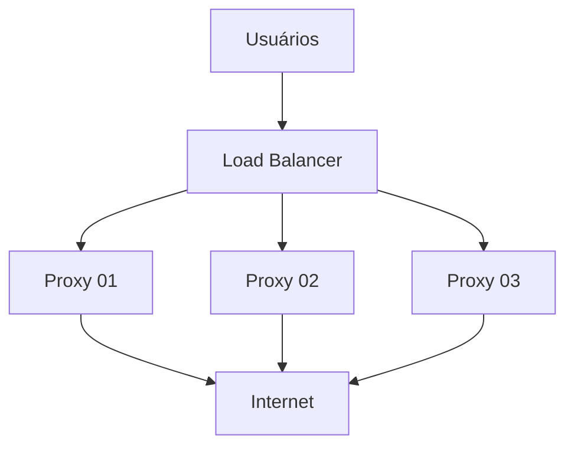

# Markdown para Documentação Profissional
## Índice
{:.no_toc}

* Índice gerado automaticamente
{:toc}



## 1. Objetivo

Este guia mostra como usar Markdown para criar documentação técnica **organizada, legível e fácil de manter**, com foco em infraestrutura:

- Linux, redes e servidores
- Ansible, Docker e Kubernetes
- Git e CI/CD
- Monitoramento e troubleshooting
- A documentação do **Infra Linux** publicada no GitHub Pages

Pré-requisito: conhecer a sintaxe básica, apresentada no *Guia Prático de Markdown*. Aqui o foco é **como escrever bem**, não como digitar cada símbolo.

---

## 2. Princípio central

> **Escreva para a pessoa que precisará resolver o problema às 3 horas da manhã.**

Essa pessoa está cansada, sob pressão e não conhece o contexto. Para ela, uma boa página tem:

- comandos claros e copiáveis;
- pré-requisitos explícitos;
- passos numerados;
- resultado esperado depois de cada etapa importante;
- avisos de risco antes dos comandos perigosos;
- troubleshooting;
- links para páginas relacionadas.

Uma pessoa deve conseguir abrir **uma página** e seguir o procedimento sem procurar informações espalhadas.

---

## 3. Tipos de página

Nem toda página tem o mesmo objetivo. Definir o tipo antes de escrever evita textos que misturam tudo.

| Tipo | Objetivo | Exemplo |
|---|---|---|
| **Conceito** | Explicar o que é e por que existe | O que é um inventário Ansible |
| **Procedimento** | Levar o leitor de A até B, passo a passo | Alterar a configuração do Squid |
| **Referência** | Consulta rápida, sem explicação longa | Comandos Ansible mais usados |
| **Troubleshooting** | Diagnosticar e resolver um problema | Squid não inicia |

Evite misturar: uma página de procedimento não precisa explicar toda a teoria; ela aponta para a página de conceito.

---

## 4. Estrutura recomendada

Modelo geral para uma página técnica:

```markdown
# Nome da tecnologia

## Introdução

## Conceitos

## Pré-requisitos

## Instalação

## Configuração

## Utilização

## Exemplos

## Validação

## Troubleshooting

## Boas práticas

## Referências
```

Nem toda página precisa de todas as seções. **Use apenas o que fizer sentido**, mas mantenha a ordem: conceito, preparação, execução, validação, problemas.

Fluxo mental do leitor:

```text
O que é? → Como instalar? → Como configurar? → Como usar? → Como validar? → Como resolver problemas?
```

---

## 5. Títulos e hierarquia

A hierarquia deve ser consistente, porque ela gera o índice, a navegação e as âncoras.

```markdown
# Ansible

## Inventários

### Inventário estático

### Inventário dinâmico

## Playbooks

### Estrutura

### Variáveis
```

Regras:

- **Um único H1** por página (o título).
- **Não pule níveis.** Evite `#` seguido de `###`.
- Títulos curtos e descritivos: "Validação", não "Agora vamos validar se tudo funcionou".
- Prefira títulos **únicos** na página, porque títulos repetidos geram âncoras duplicadas.
- Em páginas de procedimento, títulos que indiquem ação ("Recarregar o serviço") ajudam na leitura.

---

## 6. Código deve ser tratado como código

Tudo que o leitor precisa **copiar e executar** vai em bloco de código.

Ruim:

```markdown
Execute ansible squid -i squid.ini -m ping para verificar a conexão.
```

Bom:

````markdown
Execute o seguinte comando para verificar a conexão:

```bash
ansible squid -i squid.ini -m ping
```
````

### 6.1 Comando x resultado

Esta é uma das práticas mais importantes em infraestrutura. Comandos vão em `bash`; saídas vão em `text`.

Comando:

```bash
systemctl is-active squid
```

Resultado esperado:

```text
active
```

Assim fica claro o que o usuário deve **executar** e o que deve **esperar como resposta**.

### 6.2 Use a linguagem correta

| Conteúdo | Identificador |
|---|---|
| Comandos de shell | `bash` |
| Saídas e logs | `text` |
| Playbooks, Kubernetes | `yaml` |
| Inventários e configurações INI | `ini` |
| Arquivos de configuração genéricos | `conf` |
| Respostas de API | `json` |
| Alterações em arquivos | `diff` |
| Diagramas | `mermaid` |

Exemplos:

```yaml
---
- name: Testar servidores
  hosts: squid
  tasks:
    - name: Verificar hostname
      ansible.builtin.command: hostname
```

```ini
[squid]
10.0.27.72
10.0.27.73
```

```diff
- http_port 8080
+ http_port 3128
```

O `diff` é excelente para mostrar **antes e depois** de uma configuração.

### 6.3 Comandos longos

Divida com `\` quando a linha ficar difícil de ler. O comando continua sendo uma única instrução.

```bash
ansible-playbook \
  -i /opt/ansible/squid/inventory/proxy_squid \
  /opt/ansible/squid/playbooks/squid_url_manager.yml \
  -e "url=.teste-ansible.infraero.local" \
  -e "acao=liberar"
```

### 6.4 Não copie o prompt

Em blocos `bash`, escreva apenas o comando, sem `[root@servidor ~]#` nem `$`. Se precisar mostrar uma sessão completa, use `text`:

```text
[root@s-sesu2772 ~]# systemctl is-active squid
active
```

### 6.5 Placeholders

Comandos que o leitor precisa adaptar usam **placeholders em maiúsculas**, explicados logo depois:

```bash
ssh USUARIO@IP_DO_SERVIDOR
```

```text
USUARIO         = usuário de acesso ao servidor
IP_DO_SERVIDOR  = endereço IP ou nome do servidor
```

Isso torna o documento reutilizável e evita expor dados reais.

---

## 7. Avisos de risco

Comandos que causam impacto devem ter um aviso **antes** do comando. Não esconda o risco.

```markdown
> ⚠️ **Atenção:** o comando abaixo reinicia o serviço Squid e interrompe as conexões ativas.
```

> ⚠️ **Atenção:** o comando abaixo reinicia o serviço Squid e interrompe as conexões ativas.

```bash
systemctl restart squid
```

Para comandos irreversíveis:

> ⛔ **Cuidado:** o comando abaixo remove arquivos permanentemente. Confirme o caminho antes de executar.

```bash
rm -f /caminho/arquivo
```

Sugestão de padrão para toda a documentação:

| Nível | Quando usar | Rótulo |
|---|---|---|
| Informação | Contexto útil | ℹ️ **Nota** |
| Atenção | Pode causar impacto (reinício, indisponibilidade) | ⚠️ **Atenção** |
| Perigo | Perda de dados ou ação irreversível | ⛔ **Cuidado** |

Padronize rótulos e emojis em todo o site para o leitor reconhecer o nível de risco de imediato.

---

## 8. Procedimentos passo a passo

Use lista numerada, com **uma ação por passo**. Para manter os blocos de código dentro da numeração, **indente o bloco** alinhado ao texto do item. Sem a indentação, a lista é interrompida e a numeração recomeça.

````markdown
## Alterar a configuração do Squid

1. Faça backup da configuração:

   ```bash
   cp /etc/squid/squid.conf /etc/squid/squid.conf.bak
   ```

2. Edite o arquivo:

   ```bash
   vi /etc/squid/squid.conf
   ```

3. Valide a sintaxe:

   ```bash
   squid -k parse
   ```

4. Recarregue o serviço:

   ```bash
   squid -k reconfigure
   ```

5. Verifique o status:

   ```bash
   systemctl is-active squid
   ```

   Resultado esperado:

   ```text
   active
   ```
````

Boas práticas para procedimentos:

- Coloque o **backup e a validação** antes da aplicação da mudança.
- Informe o **resultado esperado** nas etapas críticas.
- Inclua, quando possível, como **desfazer** (rollback).

---

## 9. Checklists

Checklists são ótimos para procedimentos e validações:

```markdown
## Validação

- [ ] Configuração validada
- [ ] Serviço ativo
- [ ] Porta aberta
- [ ] Logs normais
- [ ] Teste funcional realizado
```

Podem também registrar o que já foi feito:

```markdown
- [x] Backup realizado
- [x] Configuração alterada
- [x] Serviço reiniciado
```

> **No GitHub Pages:** o Jekyll padrão (kramdown) não transforma `- [ ]` em caixas de seleção; o texto aparece como está. Confira o resultado no seu site (veja a seção 20).

---

## 10. Tabelas

Use tabelas para **dados comparáveis**: servidores, portas, parâmetros, versões.

```markdown
| Servidor | IP | Serviço | Porta |
|---|---|---|---|
| Proxy 01 | 10.0.27.72 | Squid | 3128 |
| Proxy 02 | 10.0.27.73 | Squid | 3128 |
| Proxy 03 | 10.0.27.75 | Squid | 3128 |
```

| Servidor | IP | Serviço | Porta |
|---|---|---|---|
| Proxy 01 | 10.0.27.72 | Squid | 3128 |
| Proxy 02 | 10.0.27.73 | Squid | 3128 |
| Proxy 03 | 10.0.27.75 | Squid | 3128 |

**Não use tabelas para texto longo ou layout.** Se a célula tem um parágrafo, use títulos.

Ruim:

```markdown
| Passo | Explicação |
|---|---|
| 1 | Texto muito grande, com vários comandos e observações... |
```

Melhor:

```markdown
### Passo 1: Fazer backup

Texto explicativo e comando.
```

Também evite guardar em tabelas informações que mudam com frequência (status atual, uso de CPU): elas ficam desatualizadas.

---

## 11. Links e navegação

Uma boa documentação forma uma **rede de conhecimento**: cada página aponta para as relacionadas.

```markdown
Para entender inventários, consulte [Inventários do Ansible](inventarios.html).
```

Links para uma seção da mesma página:

```markdown
[Ir para Troubleshooting](#troubleshooting)
```

### 11.1 Links `.md` x `.html` no Jekyll

Este é um erro muito comum. O Jekyll converte `inventarios.md` em `inventarios.html` (ou em `/inventarios/`, se o site usar *permalinks* amigáveis). Portanto:

- Um link para `inventarios.md` funciona **no GitHub** (navegando pelo repositório), mas pode gerar **erro 404 no site publicado**.
- Um link para `inventarios.html` funciona **no site**, mas pode não funcionar ao navegar pelo repositório.

Como resolver:

1. Escolha **um padrão** e use-o em todas as páginas.
2. Prefira caminhos que o site publicado entende (`.html` ou o permalink configurado).
3. O Jekyll oferece formas mais robustas, como o plugin `jekyll-relative-links` e os recursos do Liquid para gerar URLs (tema do guia de Jekyll). Confira o que está habilitado no seu site.
4. **Teste os links no site publicado**, não apenas no editor.

### 11.2 Índice da página

Para documentos grandes, um índice ajuda:

```markdown
## Índice

- [Introdução](#introdução)
- [Instalação](#instalação)
- [Troubleshooting](#troubleshooting)
```

Índices manuais quebram quando um título é renomeado. O kramdown (Jekyll) gera índice automático com esta marcação:

```markdown
* TOC
{:toc}
```

Para documentos pequenos, nenhum índice é necessário.

### 11.3 Textos de link

Escreva links que façam sentido fora do contexto.

| Ruim | Bom |
|---|---|
| Clique [aqui](inventarios.html) | Consulte [Inventários do Ansible](inventarios.html) |

---

## 12. Imagens

Use imagens quando elas realmente ajudam: arquitetura, telas, fluxos.

```markdown

```

O texto alternativo deve explicar **o que a imagem mostra**.

| Ruim | Bom |
|---|---|
| `` | `` |

Cuidados:

- Comandos e saídas **não** devem ser imagens; use texto, que é pesquisável e copiável.
- Antes de publicar, confira se **prints não mostram** senhas, tokens, IPs sensíveis ou nomes de usuários.
- Use nomes de arquivo sem espaços ou acentos.

---

## 13. Diagramas com Mermaid

Diagramas em texto são fáceis de versionar e revisar no Git. No GitHub funcionam diretamente. **No GitHub Pages é necessário incluir a biblioteca Mermaid no layout do site** (assunto do guia de Jekyll); sem isso, aparece o código do diagrama.

Arquitetura simples:

````markdown

````

Arquitetura com vários servidores:

````markdown

````

Uma boa página de infraestrutura pode **começar com o diagrama** e, em seguida, detalhar os servidores em uma tabela.

---

## 14. Modelos de páginas

### 14.1 Troubleshooting

````markdown
# Troubleshooting: Squid

## Sintoma

Descrever o problema observado.

## Possíveis causas

- Causa 1
- Causa 2

## Diagnóstico

### 1. Verificar o serviço

```bash
systemctl status squid
```

### 2. Verificar os logs

```bash
tail -n 50 /var/log/squid/cache.log
```

### 3. Testar a conectividade

```bash
curl -I https://exemplo.com
```

## Solução

Descrever o procedimento de correção.

## Validação

Como confirmar que o problema foi resolvido.
````

Organize o diagnóstico da causa **mais provável e mais simples** para a mais rara.

### 14.2 Referência de comandos

Uma "cheat sheet" tem pouco texto e muitos exemplos. Cada item: um título, um comando.

````markdown
# Ansible: Referência rápida

## Testar conectividade

```bash
ansible squid -i squid.ini -m ping
```

## Verificar hostname

```bash
ansible squid -i squid.ini -m shell -a "hostname"
```

## Limitar a determinados servidores

```bash
ansible squid \
  -i squid.ini \
  --limit "s-sesu872,s-sesu873" \
  -m shell \
  -a "hostname"
```
````

### 14.3 Documentando arquivos de configuração

Indique o caminho, o propósito e um trecho relevante:

````markdown
O arquivo principal do Squid é `/etc/squid/squid.conf`. Trecho relevante:

```conf
http_port 3128
cache_mem 256 MB
```
````

Para arquivos grandes, mostre **apenas o trecho necessário** e use `diff` para alterações.

### 14.4 Estrutura de diretórios

```text
/opt/ansible/
├── squid/
│   ├── inventory/
│   │   └── proxy_squid
│   ├── playbooks/
│   │   ├── teste.yml
│   │   └── squid_url_manager.yml
│   └── templates/
└── README.md
```

Explique o papel de cada pasta logo abaixo da árvore.

### 14.5 Comandos de diagnóstico

Um comando por seção:

| Objetivo | Comando |
|---|---|
| CPU | `top` |
| Memória | `free -h` |
| Disco | `df -h` |
| Processos | `ps aux` |
| Portas em escuta | `ss -lntup` |

Quando cada comando exigir explicação e exemplo de saída, converta a tabela em seções, cada uma com bloco `bash` e bloco `text`.

### 14.6 README.md

O README é a porta de entrada de um repositório. Deve responder: o que é, como instalar, como usar, como contribuir e onde está a documentação.

````markdown
# Projeto Ansible Squid

Automação de servidores Squid.

## Estrutura

- `inventory/`: inventários
- `playbooks/`: playbooks
- `templates/`: templates

## Execução

```bash
ansible-playbook \
  -i inventory/proxy_squid \
  playbooks/teste.yml
```

## Documentação

- [Inventários](docs/inventarios.md)
- [Playbooks](docs/playbooks.md)
````

---

## 15. Organização dos arquivos

### 15.1 Um assunto por arquivo

Evite um arquivo gigante (`ansible.md`) com tudo. Separe por assunto e use um `index.md` como ponto de entrada:

```text
ansible/
├── index.md
├── inventarios.md
├── playbooks.md
├── modulos.md
├── variaveis.md
├── templates.md
└── troubleshooting.md
```

Exemplo de `index.md`:

```markdown
# Ansible

Ansible é uma ferramenta de automação de infraestrutura.

## Documentação

- [Inventários](inventarios.html)
- [Playbooks](playbooks.html)
- [Módulos](modulos.html)
- [Troubleshooting](troubleshooting.html)
```

### 15.2 Nomes de arquivos

Nomes simples, previsíveis, em **minúsculas, sem acentos nem espaços**, separados por hífen:

| Bom | Ruim |
|---|---|
| `inventarios.md` | `Meu Documento Novo.md` |
| `docker-images.md` | `Documento_FINAL_2.md` |
| `git-branch.md` | `teste123.md` |

Evite renomear arquivos depois de publicados: isso quebra links (internos e de terceiros).

---

## 16. Versionamento e histórico

Como a documentação está no Git, cada alteração deve ser versionada com mensagens claras:

```bash
git status
git add .
git commit -m "Adiciona documentação sobre módulos Ansible"
git push
```

Boas mensagens de commit descrevem **o que mudou e em qual assunto**:

| Ruim | Bom |
|---|---|
| `atualização` | `Corrige comando de validação na página do Squid` |
| `ajustes` | `Adiciona seção de troubleshooting ao Docker` |

---

## 17. Documentação x registro de mudanças

São coisas diferentes e não devem ser misturadas.

**Documentação** explica *como fazer*:

````markdown
Para verificar o serviço:

```bash
systemctl status squid
```
````

**Registro** informa *o que aconteceu*:

```text
23/09/2026 - Squid reiniciado após alteração de configuração.
```

Registros de mudanças relevantes podem seguir um modelo:

```markdown
## Alteração

Adicionada a verificação do status do Squid.

## Data

2026-09-23

## Motivo

Melhorar o diagnóstico automatizado dos servidores.

## Arquivos alterados

- `diagnostico_squid.yml`
- `README.md`
```

O histórico do Git já registra *quem* e *quando*; o registro escrito explica *por quê*.

### 17.1 Evite informações temporárias

Não escreva estados momentâneos:

```markdown
O servidor está com 84% de CPU agora.
```

Isso ficará obsoleto. Ensine **como verificar**:

````markdown
Para verificar o consumo de CPU:

```bash
top
```
````

---

## 18. Informações sensíveis

Nunca coloque na documentação:

```text
senhas          tokens           chaves privadas
credenciais     cookies          segredos
dados pessoais
```

Use placeholders (`USUARIO`, `SENHA`, `TOKEN`, `IP_DO_SERVIDOR`).

Atenção especial, principalmente para este projeto:

- **Um site no GitHub Pages é público** por padrão, mesmo que o conteúdo pareça técnico e "interno". Publicar em repositório privado exige plano com suporte específico.
- **Hostnames, domínios internos e IPs privados** revelam a topologia da rede. Avalie se precisam aparecer. Se forem exemplos, prefira valores fictícios (por exemplo, a faixa `192.0.2.0/24`, reservada para documentação) e domínios como `exemplo.local`.
- **Prints, logs e saídas de comandos** frequentemente contêm dados que passam despercebidos: usuários, caminhos, IPs, tokens em URLs.
- **Comentários HTML** (`<!-- -->`) não aparecem na página, mas ficam visíveis no código-fonte HTML.
- **O histórico do Git guarda tudo.** Remover uma senha em um commit posterior não a apaga do histórico; se um segredo vazar, considere-o comprometido e troque-o.
- Consulte a política de segurança da sua organização antes de publicar material de ambientes reais.

---

## 19. Exemplos reais e completos

Exemplos próximos do ambiente real ajudam mais do que exemplos genéricos, **desde que o item 18 seja respeitado**.

Genérico:

```bash
ansible servidor -m ping
```

Com contexto:

````markdown
Execute o playbook usando o inventário dos servidores Squid:

```bash
ansible-playbook \
  -i /opt/ansible/squid/inventory/proxy_squid \
  /opt/ansible/squid/playbooks/teste.yml
```
````

Cada exemplo deve informar **o contexto**, **o comando** e **o resultado esperado**.

---

## 20. Markdown + Jekyll + GitHub Pages

O Markdown não trabalha sozinho. No Infra Linux, o fluxo é:

```text
arquivo .md → Jekyll → Layout/Liquid → HTML → CSS → GitHub Pages → Navegador
```

Cada ferramenta tem uma função:

| Ferramenta | Função |
|---|---|
| Markdown | Escrever o conteúdo |
| HTML | Estruturas específicas, quando necessário |
| CSS | Aparência |
| Liquid | Recursos dinâmicos e geração de URLs |
| Jekyll | Gerar as páginas do site |
| Git | Versionamento |
| GitHub Pages | Publicação |

### 20.1 Front matter

Cada página processada pelo Jekyll normalmente começa com um bloco YAML entre `---`:

```yaml
---
layout: default
title: Ansible
---
```

O front matter **não é Markdown**: é informação para o Jekyll (layout, título, ordem no menu etc.). O conteúdo Markdown vem depois dele.

### 20.2 Diferenças que você precisa conhecer

O que funciona no GitHub nem sempre funciona no site:

| Recurso | Repositório (GitHub) | Site (Jekyll padrão) |
|---|:---:|:---:|
| Tabelas, código, listas, imagens | ✅ | ✅ |
| Checklists `- [ ]` clicáveis | ✅ | ❌ |
| Alertas `> [!NOTE]` | ✅ | ❌ |
| Mermaid | ✅ | ❌ (requer script no layout) |
| Emojis `:warning:` | ✅ | ⚠️ (requer `jemoji`) |
| Links para `.md` | ✅ | ⚠️ (podem quebrar) |
| Front matter | Exibido como tabela | Processado pelo Jekyll |

Para avisos no site, use citação com classe CSS (kramdown):

```markdown
> **Atenção:** faça backup antes de alterar o arquivo.
{: .warning }
```

Depois, estilize `.warning` no CSS do tema.

### 20.3 Cuidado com o Liquid em exemplos de código

O Jekyll processa o Liquid (`` e `{{ ... }}`) **inclusive dentro de blocos de código**. Se você documentar Ansible com templates Jinja2 (`{{ variavel }}`) ou Helm/Go templates, o Jekyll tentará interpretá-los e a página pode ficar sem o conteúdo ou falhar no build.

A solução é envolver o trecho com as tags `raw` e `endraw` do Liquid, o que será detalhado no guia de Jekyll. Sempre que documentar `{{ }}` ou ``, verifique o resultado no site.

### 20.4 Teste antes de publicar

- Rode o site localmente, se possível (`bundle exec jekyll serve`), ou confira a página após o *build* do GitHub Pages.
- Verifique: blocos de código, tabelas, links internos, imagens, diagramas.
- Se a página falhar no build, a aba **Actions** do repositório indica o erro.

---

## 21. Organização sugerida para o Infra Linux

```text
infra-linux.github.io/
├── index.md
├── linux/
│   ├── index.md
│   ├── comandos.md
│   ├── systemd.md
│   ├── rede.md
│   └── troubleshooting.md
├── devops/
│   ├── index.md
│   ├── git/
│   │   ├── index.md
│   │   ├── branch.md
│   │   └── pull-request.md
│   ├── ansible/
│   │   ├── index.md
│   │   ├── inventarios.md
│   │   ├── playbooks.md
│   │   ├── modulos.md
│   │   └── troubleshooting.md
│   ├── docker/
│   │   ├── index.md
│   │   ├── images.md
│   │   └── containers.md
│   └── documentacao/
│       ├── index.md
│       ├── markdown.md
│       └── jekyll.md
└── img/
```

Essa organização separa a **tecnologia** da **ferramenta usada para documentá-la**. Dentro de "Documentação" ficam duas páginas complementares:

| Página | Assuntos |
|---|---|
| **Markdown** | Sintaxe, código, tabelas, links, imagens, Mermaid, boas práticas |
| **Jekyll** | Estrutura, front matter, layouts, includes, Liquid, build |

Depois de dominar Markdown, aprender Jekyll é o próximo passo natural.

---

## 22. Manutenção

Documentação desatualizada é pior que a ausência de documentação, porque leva a decisões erradas.

- **Teste os comandos** antes de publicá-los, no ambiente onde serão usados.
- **Revise periodicamente** as páginas mais usadas.
- **Atualize a página no mesmo momento** em que o procedimento mudar (idealmente, no mesmo commit da mudança).
- Informe **versões** quando importarem (por exemplo, "testado no Rocky Linux 9 e Squid 5").
- Considere registrar no início da página a data da última revisão.
- Remova ou marque como **obsoletas** páginas que não valem mais.
- Peça a alguém que **siga a página sem ajuda**: onde a pessoa travar, a documentação precisa melhorar.

---

## 23. Checklist de qualidade

Antes de publicar uma página:

**Conteúdo**

- [ ] O título é claro e há um único H1?
- [ ] O objetivo da página está explicado?
- [ ] Os pré-requisitos estão definidos?
- [ ] Os comandos foram testados e revisados?
- [ ] Há exemplos práticos?
- [ ] Há instruções de validação e resultado esperado?
- [ ] Há troubleshooting ou link para ele?
- [ ] Os comandos perigosos têm aviso de risco?

**Formatação**

- [ ] Os comandos estão em blocos de código com a linguagem correta?
- [ ] Comandos (`bash`) e resultados (`text`) estão separados?
- [ ] Os placeholders estão explicados?
- [ ] As imagens têm texto alternativo?
- [ ] Os passos numerados mantêm os blocos de código indentados?

**Segurança**

- [ ] Não há senhas, tokens, chaves ou segredos?
- [ ] Não há IPs, hostnames ou dados internos desnecessários?
- [ ] Prints e logs foram revisados?

**Publicação**

- [ ] Os links internos foram testados no **site publicado**?
- [ ] A página foi conferida no GitHub e no GitHub Pages?
- [ ] A mensagem do commit descreve a mudança?

---

## 24. Resumo

Pense no Markdown como a **linguagem de escrita** da documentação. Os elementos mais usados no Infra Linux:

| Elemento | Uso |
|---|---|
| `#` | Títulos |
| `**texto**` | Destaque |
| `` `código` `` | Comandos, arquivos e serviços no meio do texto |
| ` ```bash ` | Comandos |
| ` ```text ` | Resultados e logs |
| ` ```yaml `, ` ```ini `, ` ```json ` | Arquivos de configuração |
| ` ```diff ` | Alterações |
| ` ```mermaid ` | Diagramas |
| `\| A \| B \|` | Tabelas |
| `- [ ]` | Checklists |
| `>` | Avisos e observações |
| `[texto](url)` | Links |
| `` | Imagens |

E organize sempre pensando no leitor:

```text
O que é? → Como instalar? → Como configurar? → Como usar? → Como validar? → Como resolver problemas?
```

Esse padrão transforma um conjunto de páginas Markdown em uma verdadeira **base de conhecimento de infraestrutura**.

