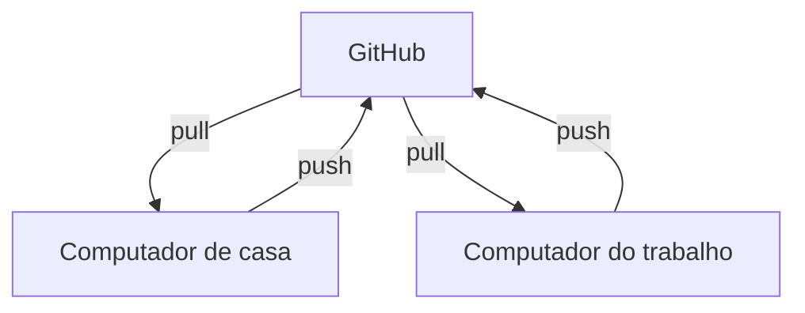
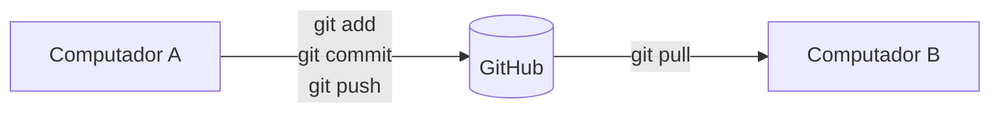
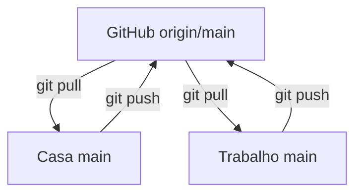

# Sincronizando um projeto Git entre casa e trabalho
{:.no_toc}

Este guia mostra como manter uma cópia local de um projeto Git sincronizada com o GitHub, usando como exemplo o seguinte fluxo de trabalho:

- alterar o projeto em casa;
- enviar as alterações para o GitHub;
- chegar ao trabalho e atualizar o computador de trabalho;
- lidar com alterações locais, divergências e conflitos;
- entender quando usar `git pull`, `git fetch` e `git reset --hard`.

## Sumário

* TOC
{:toc}

---

## 1. O cenário

O projeto fica no GitHub e você trabalha em duas máquinas:



Quando termina uma alteração em uma máquina, o fluxo normal é:

```bash
git add .
git commit -m "Descrição da alteração"
git push
```

O `push` envia o commit para o GitHub. Depois, na outra máquina:

```bash
git pull
```

O `pull` baixa as alterações e atualiza a cópia local.

### Fluxo básico



---

## 2. Antes de qualquer coisa: verificar o estado

Antes de atualizar o projeto, execute:

```bash
git status
```

Exemplo de saída:

```text
On branch main
Your branch is up to date with 'origin/main'.

nothing to commit, working tree clean
```

Isso significa que:

- você está na branch `main`;
- sua branch local está sincronizada com `origin/main`;
- não existem alterações locais pendentes.

---

## 3. O que é `origin`?

Quando você clona um repositório:

```bash
git clone https://github.com/usuario/projeto.git
```

o Git normalmente cria um remoto chamado `origin`. Você pode conferir com:

```bash
git remote -v
```

Exemplo:

```text
origin  https://github.com/pangolimbr/pangolimbr.github.io.git (fetch)
origin  https://github.com/pangolimbr/pangolimbr.github.io.git (push)
```

Ou seja, `origin` é o apelido do repositório remoto no GitHub.

---

## 4. O que é `origin/main`?

Existem duas referências importantes:

- **`main`**: a branch `main` que existe na sua máquina.
- **`origin/main`**: uma referência local que representa o último estado *conhecido* da branch `main` no remoto `origin`.

```text
Seu computador                    GitHub

main                              main
 │                                 │
 └── seu trabalho local            └── versão remota

          origin/main
               │
               └── cópia local da informação do remoto
```

O `git fetch` é o comando que atualiza `origin/main`.

> **Nota:** repositórios mais antigos podem usar `master` em vez de `main`. Ajuste os comandos conforme o nome da sua branch.

---

## 5. O comando mais comum: `git pull`

Para simplesmente atualizar sua máquina:

```bash
git pull
```

Esse é o comando que normalmente deve ser usado no dia a dia. Ele combina duas operações:

```text
git fetch  +  git merge
```

Quando não há commits locais divergentes, o Git faz um *fast-forward* em vez de criar um commit de merge.

---

## 6. Exemplo prático

O computador de casa estava no commit `91ace6e`. Você fez alterações e executou:

```bash
git add .
git commit -m "Atualização da home"
git push
```

O GitHub passou a ter o commit `ccbcd75`. O computador do trabalho ainda estava em `91ace6e`, então você executou:

```bash
git pull
```

O Git encontrou `91ace6e → ccbcd75` e atualizou a máquina. Uma saída típica:

```text
91ace6e..ccbcd75  main -> origin/main
Updating 91ace6e..ccbcd75
Fast-forward
```

Isso significa que a atualização foi feita sem conflito.

---

## 7. O que significa *fast-forward*?

Imagine a seguinte história:

```text
A---B---C
```

Seu computador está em `A` e o GitHub está em `C`. Se não existem commits diferentes criados localmente, o Git simplesmente avança a branch:

```text
A---B---C
        ↑
       main
```

Isso é um **fast-forward**: uma situação simples e normalmente desejável.

---

## 8. Quando `git pull` é suficiente?

Na maioria das situações de trabalho entre dois computadores, `git pull` basta:

```text
Casa
 ↓  git add . / git commit / git push
GitHub
 ↓
Trabalho
 ↓  git pull
```

Não é necessário executar `git fetch origin` seguido de `git reset --hard origin/main` toda vez.

---

## 9. O que faz `git fetch origin`?

```bash
git fetch origin
```

baixa as informações mais recentes do repositório remoto, mas **não altera** os arquivos da sua branch de trabalho.

Antes:

```text
main        → A
origin/main → A
```

Alguém envia um novo commit para o GitHub (`main → B`). Você executa `git fetch origin` e agora:

```text
main        → A
origin/main → B
```

Sua `main` continua em `A`. O Git apenas descobriu que o remoto avançou para `B`.

---

## 10. `fetch` é útil para verificar antes de atualizar

Depois do `fetch`, você pode inspecionar o que mudou antes de mexer na sua branch:

```bash
git fetch origin
git status
git log --oneline --decorate --graph --all
git diff main origin/main
```

---

## 11. O comando mais agressivo: `git reset --hard origin/main`

```bash
git reset --hard origin/main
```

faz sua branch atual apontar para o mesmo commit de `origin/main` **e sobrescreve os arquivos do diretório de trabalho** para ficar igual a esse commit.

Normalmente é usado junto com o `fetch`:

```bash
git fetch origin
git reset --hard origin/main
```

Na prática: *"Atualize as informações do GitHub e faça minha branch local ficar exatamente igual à `origin/main`."*

---

## 12. Por que `reset --hard` é perigoso?

Porque ele descarta:

- alterações locais **não commitadas** em arquivos rastreados;
- commits locais que **ainda não foram enviados** (`push`) e que não existem no remoto.

Exemplo de divergência:

```text
GitHub:      A---B
Computador:  A---C
```

Se você executar `git reset --hard origin/main` aqui, o commit `C` deixa de fazer parte da sua branch.

Antes de usar o comando, verifique:

```bash
git status
```

Se aparecer algo como:

```text
modified: assets/css/style.css
```

pare e verifique se você precisa dessa alteração.

> **Observação:** `reset --hard` não remove arquivos *novos* ainda não rastreados (untracked). Para isso existe o `git clean`, que é ainda mais destrutivo e deve ser usado com muito cuidado.

---

## 13. Quando usar `fetch` + `reset --hard`?

Use quando você quer **deliberadamente** deixar a cópia local exatamente igual ao remoto. Por exemplo, quando:

- você não precisa das alterações locais;
- o GitHub contém a versão correta;
- você quer descartar qualquer alteração local;
- você quer eliminar uma divergência local.

Exemplo típico: *"Mexi em vários arquivos localmente, não quero guardar nada e quero voltar exatamente para o que está no GitHub."*

```bash
git fetch origin
git reset --hard origin/main
```

---

## 14. Existem alterações locais que você quer manter

Se `git status` mostrar:

```text
modified: arquivo.md
```

e você quer manter a alteração, **não** use `reset --hard`. Faça um commit:

```bash
git add .
git commit -m "Minhas alterações"
git pull
```

Se houver divergências, o Git pedirá que você as resolva.

---

## 15. Guardar alterações temporariamente com `git stash`

O `git stash` guarda temporariamente as alterações não commitadas:

```bash
git stash
git pull
git stash pop
```

Fluxo:

```text
Alterações locais
       │
       ▼
   git stash
       │
       ▼
   git pull
       │
       ▼
  git stash pop
```

Se houver conflito ao recuperar o stash, o Git informará os arquivos envolvidos.

> **Dica:** por padrão o `stash` não guarda arquivos novos não rastreados. Para incluí-los, use `git stash -u`.

---

## 16. `git pull` informa que existem alterações locais

Você pode receber algo como:

```text
error: Your local changes to the following files would be overwritten by merge:
```

Isso significa que o `pull` sobrescreveria alterações locais. Primeiro execute `git status` e depois escolha uma estratégia.

**Quero manter as alterações** (commit):

```bash
git add .
git commit -m "Minhas alterações"
git pull
```

**Quero guardar temporariamente** (stash):

```bash
git stash
git pull
git stash pop
```

**Não quero essas alterações** (descartar):

```bash
git restore .
git pull
```

> **Atenção:** `git restore .` descarta as alterações locais não commitadas dos arquivos rastreados. Não há como desfazer.

---

## 17. O Git diz que existem commits divergentes

Divergência acontece quando os dois lados têm commits diferentes:

```text
Seu computador:  A---B
GitHub:          A---C
```

Isso é diferente de:

```text
Seu computador:  A
GitHub:          A---B
```

No segundo caso, `git pull` normalmente resolve com fast-forward. No primeiro, o Git precisa fazer um merge (ou um rebase).

Versões recentes do Git podem pedir que você escolha a estratégia. Opções comuns:

```bash
git pull --no-rebase   # faz merge
git pull --rebase      # reaplica seus commits sobre o remoto
git pull --ff-only     # só atualiza se for fast-forward; caso contrário, aborta
```

---

## 18. O que é um conflito?

Um conflito acontece quando duas versões modificaram a mesma parte de um arquivo de forma incompatível.

Exemplo:

- Computador: `<h1>Pangolim</h1>`
- GitHub: `<h1>Pangolim — Infraestrutura</h1>`

O arquivo pode ficar assim:

```text
<<<<<<< HEAD
<h1>Pangolim</h1>
=======
<h1>Pangolim — Infraestrutura</h1>
>>>>>>> origin/main
```

Você precisa escolher ou combinar as versões, removendo os marcadores `<<<<<<<`, `=======` e `>>>>>>>`. Depois:

```bash
git add arquivo
git commit
```

---

## 19. Como cancelar um merge com conflito

Se um `git pull` resultou em um merge que você quer cancelar:

```bash
git merge --abort
```

Isso tenta retornar ao estado anterior ao merge. Depois, analise a situação:

```bash
git status
```

---

## 20. Como descobrir onde estou?

Para ver a branch atual:

```bash
git branch
```

A branch atual aparece com `*`:

```text
* main
```

Você também pode usar `git status`.

---

## 21. Como ver os commits?

```bash
git log --oneline
```

Exemplo:

```text
ccbcd75 Atualização da home
91ace6e Alterações no layout
```

Para mostrar as datas:

```bash
git log --pretty=format:"%h %ad %s" --date=short
```

Exemplo:

```text
ccbcd75 2026-09-30 Atualização da home
91ace6e 2026-09-29 Alterações no layout
```

---

## 22. Como verificar se estou sincronizado?

```bash
git status
```

Se aparecer:

```text
Your branch is up to date with 'origin/main'.
```

sua branch local está sincronizada com a referência remota *conhecida*. Para garantir que essa referência esteja atualizada:

```bash
git fetch origin
git status
```

---

## 23. Como atualizar somente o computador?

Se o GitHub já possui a versão correta, basta:

```bash
git pull
```

Não é necessário `git add`, `git commit` ou `git push`, pois essas operações servem para **enviar** alterações locais.

---

## 24. Como enviar alterações para o GitHub?

```bash
git status
git add .
git commit -m "Descrição da alteração"
git push
```

Fluxo:

```text
Editar arquivos
      ↓
  git status
      ↓
  git add .
      ↓
  git commit
      ↓
  git push
      ↓
   GitHub
```

---

## 25. Fluxo recomendado para dois computadores

### Trabalhando em casa

```bash
git status
# faça as alterações
git add .
git commit -m "Descrição da alteração"
git push
```

### Chegando ao trabalho

Antes de alterar arquivos:

```bash
git status
git pull
```

Faça seu trabalho e depois:

```bash
git add .
git commit -m "Descrição da alteração"
git push
```

### Voltando para casa

```bash
git status
git pull
```

E continue trabalhando.

---

## 26. Regra simples para lembrar

**Quero baixar as alterações do GitHub:**

```bash
git pull
```

**Quero apenas consultar/atualizar o que existe no remoto:**

```bash
git fetch origin
```

**Quero deixar minha branch exatamente igual ao GitHub e descartar alterações locais:**

```bash
git fetch origin
git reset --hard origin/main
```

**Quero enviar minhas alterações:**

```bash
git add .
git commit -m "Descrição"
git push
```

**Quero verificar a situação:**

```bash
git status
```

---

## 27. Tabela de referência rápida

| Situação | Comando |
|----------|---------|
| Ver estado do projeto | `git status` |
| Atualizar normalmente | `git pull` |
| Consultar atualizações remotas | `git fetch origin` |
| Enviar alterações | `git push` |
| Ver commits | `git log --oneline` |
| Ver branches | `git branch` |
| Guardar alterações temporariamente | `git stash` |
| Recuperar stash | `git stash pop` |
| Descartar alterações locais dos arquivos rastreados | `git restore .` |
| Deixar a cópia local igual ao remoto | `git fetch origin` + `git reset --hard origin/main` |
| Cancelar merge em andamento | `git merge --abort` |

---

## 28. Atenção especial ao `reset --hard`

Memorize a diferença.

```bash
git pull
```

significa, de forma simplificada: *"Traga as alterações remotas e tente integrá-las ao meu trabalho."*

Já:

```bash
git fetch origin
git reset --hard origin/main
```

significa: *"Atualize a informação do remoto e descarte meu estado local para ficar igual a `origin/main`."*

Por isso, **não use `reset --hard` como substituto automático do `git pull`**.

Para o fluxo normal entre casa e trabalho, prefira:

```bash
git status
git pull
```

E use `fetch` + `reset --hard` somente quando você conscientemente quiser descartar o estado local e deixar a cópia igual ao GitHub.

---

## 29. Exemplo completo do Pangolim

Suponha que você esteja em casa:

```powershell
cd C:\Users\seu_usuario\Documents\GitHub\Projetos\pangolimbr.github.io
```

Faça uma alteração e depois:

```bash
git status
git add .
git commit -m "Atualização da documentação"
git push
```

No trabalho:

```powershell
cd C:\Users\seu_usuario\Documents\GitHub\Projetos\pangolimbr.github.io
git status
git pull
```

Se o Git mostrar `Fast-forward`, a atualização ocorreu normalmente. Se o `git status` mostrar:

```text
nothing to commit, working tree clean
```

não há alterações locais pendentes.

---

## 30. Fluxo mental definitivo



- **Quem terminou uma alteração:** `git add .`, `git commit -m "..."`, `git push`.
- **Quem precisa receber:** `git pull`.
- **Só consultar o remoto:** `git fetch origin`.
- **Destruir o estado local e igualar ao remoto:** `git fetch origin` + `git reset --hard origin/main`.

Regra prática:

- `pull` para sincronizar normalmente;
- `fetch` para consultar/atualizar as referências remotas;
- `reset --hard` para forçar o estado local a ficar igual ao remoto, sabendo que alterações locais podem ser perdidas.