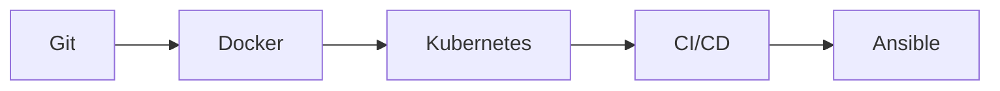

# DevOps
{:.no_toc}

<div class="toc-title">Sumário</div>
* Sumário:
{:toc}

---

## Introdução

DevOps reúne práticas que aproximam o desenvolvimento de software e as operações de infraestrutura.

Esta seção apresenta versionamento, CI/CD, automação, containers, orquestração e observabilidade em um fluxo integrado de entrega e operação.

O objetivo é entender a relação entre as ferramentas antes de avançar para implementações mais complexas.

---

## Conteúdo

Siga esta sequência para compreender o fluxo de entrega de aplicações, do versionamento à operação em Kubernetes.

<details>
  <summary>Git</summary>
  <ul>
    <li><a href="{{ 'devops/git/guia-pratico.html' | relative_url }}">Guia prático</a></li>
    <li><a href="{{ 'devops/git/git-branch-para-main.html' | relative_url }}">Branch e publicação na main</a></li>
    <li><a href="{{ 'git/clone-branch-pull-request-merge.html' | relative_url }}">Clone, Branch, Pull Request e Merge</a></li>
  </ul>
</details>

<details>
  <summary>Docker</summary>
  <ul>
    <li><a href="{{ 'devops/docker/docker-image.html' | relative_url }}">Imagens</a></li>
    <li><a href="{{ 'devops/docker/docker-container.html' | relative_url }}">Containers</a></li>
  </ul>
</details>

<details>
  <summary>Kubernetes</summary>
  <ul>
    <li><a href="{{ 'devops/kubernetes/' | relative_url }}">KUBERNETES</a></li>
    <li><a href="{{ 'devops/kubernetes/' | relative_url }}">Kubeconfig</a></li>
    <li><a href="{{ 'devops/kubernetes/' | relative_url }}">Cluster Install</a></li>
    <li><a href="{{ 'devops/kubernetes/' | relative_url }}">Kubeadm Install</a></li>
    <li><a href="{{ 'devops/kubernetes/' | relative_url }}">Pods</a></li>
    <li><a href="{{ 'devops/kubernetes/' | relative_url }}">Deployments</a></li>
    <li><a href="{{ 'devops/kubernetes/' | relative_url }}">Services</a></li>
    <li><a href="{{ 'devops/kubernetes/' | relative_url }}">Ingress</a></li>
    <li><a href="{{ 'devops/kubernetes/' | relative_url }}">Troubleshooting</a></li>
  </ul>
</details>

<details>
  <summary>CI/CD</summary>
  <ul>
    <li><a href="{{ 'devops/cicd/fundamentos-cicd.html' | relative_url }}">Imagens</a></li>
  </ul>
</details>


---
* [Ansible](ansible/index.md)
  * [Inventários]()
  * [Módulos]()
  * [Playbooks]()

* [Documentações](documentacao/index.md)
  * [Markdown]()
    * [Guia Completo]()
	* [Blocos de Código]()
	* [Tabelas]()
	* [Links e Imagens]()
	* [Listas]()

  * [Jekyll]()
    * [Guia Completo]()
	* [Layouts]()
	* [Liquid]()
	* [Includes]()
	* [Collections]()
	* [GitHub Pages]()

O fluxo pode ser resumido assim:



---

## Rotina recomendada

Depois de compreender os fundamentos, o trabalho diário costuma seguir este fluxo:

```text
Alteração em branch
	↓
Revisão
	↓
Validação automática
	↓
Merge
	↓
Build de imagem
	↓
Deploy controlado
	↓
Monitoramento
```

---

## Boas práticas

- Pratique primeiro em um ambiente de desenvolvimento.
- Valide o alvo antes de executar alterações em produção.
- Mantenha backup e defina o procedimento de rollback.
- Use branches e Pull Requests para revisar alterações.
- Registre logs e monitore o resultado do deploy.

---

> Esta seção reúne conceitos, procedimentos, automações e troubleshooting relacionados ao universo DevOps.