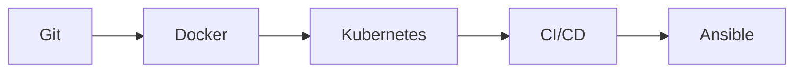

<h1 class="page-title">
  <svg class="title-icon" viewBox="0 0 24 24" fill="none" stroke="currentColor" stroke-width="1.8" stroke-linecap="round" stroke-linejoin="round" aria-hidden="true">
    <path d="M18.178 8c5.096 0 5.096 8 0 8-5.095 0-7.133-8-12.739-8-4.585 0-4.585 8 0 8 5.606 0 7.644-8 12.74-8z"/>
  </svg>
  DevOps

</h1>

---

## Introdução

DevOps reúne práticas que aproximam o desenvolvimento de software e as operações de infraestrutura.

Esta seção apresenta versionamento, CI/CD, automação, containers, orquestração e observabilidade em um fluxo integrado de entrega e operação.

O objetivo é entender a relação entre as ferramentas antes de avançar para implementações mais complexas.

---

## Conteúdo

Siga esta sequência para compreender o fluxo de entrega de aplicações, do versionamento à operação em Kubernetes.

<div class="wiki-topic-list">

  <a class="wiki-topic" href="{{ 'devops/git/index.html' | relative_url }}">
    <span class="wiki-topic-title">Git</span>
    <span class="wiki-topic-description">Versionamento de código, branches, Pull Requests e publicação na main.</span>
  </a>

  <a class="wiki-topic" href="{{ 'devops/docker/index.html' | relative_url }}">
    <span class="wiki-topic-title">Docker</span>
    <span class="wiki-topic-description">Imagens, containers, Compose, redes, volumes e Dockerfile.</span>
  </a>

  <a class="wiki-topic" href="{{ 'devops/kubernetes/index.html' | relative_url }}">
    <span class="wiki-topic-title">Kubernetes</span>
    <span class="wiki-topic-description">Cluster, kubectl, Pods, Deployments, Services e Ingress.</span>
  </a>

  <a class="wiki-topic" href="{{ 'devops/cicd/index.html' | relative_url }}">
    <span class="wiki-topic-title">CI/CD</span>
    <span class="wiki-topic-description">Integração e entrega contínuas, com automação de build e deploy.</span>
  </a>

  <a class="wiki-topic" href="{{ 'devops/ansible/index.html' | relative_url }}">
    <span class="wiki-topic-title">Ansible</span>
    <span class="wiki-topic-description">Automação de configuração com inventários, módulos e playbooks.</span>
  </a>

</div>

---

O fluxo pode ser resumido assim:


```mermaid
flowchart LR
    Git --> Docker
    Docker --> Kubernetes
    Kubernetes --> CICD["CI/CD"]
    CICD --> Ansible
```

---

## Rotina recomendada

Depois de compreender os fundamentos, o trabalho diário costuma seguir este fluxo:

```text
Alteração em branch
↓
Revisão
↓
Validação automática
↓
Merge
↓
Build de imagem
↓
Deploy controlado
↓
Monitoramento
```

---

## Boas práticas

- Pratique primeiro em um ambiente de desenvolvimento.
- Valide o alvo antes de executar alterações em produção.
- Mantenha backup e defina o procedimento de rollback.
- Use branches e Pull Requests para revisar alterações.
- Registre logs e monitore o resultado do deploy.

---

> Esta seção reúne conceitos, procedimentos, automações e troubleshooting relacionados ao universo DevOps.