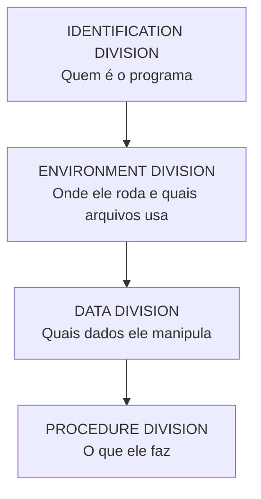

<h1 class="page-title">
  <svg class="title-icon" viewBox="0 0 24 24" fill="none" stroke="currentColor" stroke-width="1.8" stroke-linecap="round" stroke-linejoin="round" aria-hidden="true">
    <path d="M4 6h16M4 12h16M4 18h10"/>
    <path d="M17 15l3 3-3 3"/>
  </svg>
  Fundamentos
</h1>

> História, características e a estrutura básica de um programa COBOL: divisões, formato do código-fonte e regras de sintaxe.

---

## Objetivos

Ao final desta seção, você deverá ser capaz de:

- Explicar o que é COBOL e onde a linguagem é utilizada.
- Reconhecer as quatro divisões de um programa e a função de cada uma.
- Escrever o código respeitando as colunas e as áreas do formato fixo.
- Ler um programa simples e entender o que ele faz.

---

## O que é COBOL

COBOL (*Common Business-Oriented Language*) é uma linguagem de programação de alto nível criada para **processamento de dados comerciais**: cadastros, folhas de pagamento, extratos, faturamento, apólices e outras rotinas em que o volume de registros é grande e a precisão dos cálculos é essencial.

Um programa COBOL se parece com texto em inglês estruturado. Isso foi intencional: a ideia original era que o código fosse legível até para quem não era programador.

```cobol
           ADD VALOR-A TO VALOR-B GIVING TOTAL.
           IF TOTAL > LIMITE
               DISPLAY "LIMITE EXCEDIDO"
           END-IF.
```

---

## Breve história

A linguagem foi definida em 1959 por um comitê chamado CODASYL, formado por representantes de governo, universidades e fabricantes de computadores. Ela se baseou em ideias de linguagens anteriores, como o FLOW-MATIC, associado ao trabalho de Grace Hopper.

Desde então, a linguagem passou por revisões de padrão:

| Padrão | Observação |
|---|---|
| COBOL-60 | Primeira especificação |
| COBOL-68 e COBOL-74 | Primeiras padronizações formais |
| COBOL-85 | Base de grande parte do código existente. Introduziu terminadores de escopo como `END-IF` e `END-PERFORM` |
| COBOL 2002 | Formato livre de código, orientação a objetos e novos tipos de dados |
| COBOL 2014 e 2023 | Revisões e atualizações do padrão |

Na prática, boa parte dos sistemas em produção segue o estilo do COBOL-85, e por isso é importante conhecê-lo bem.

---

## Características principais

- **Legibilidade:** comandos em forma de frases, como `MOVE`, `ADD`, `DISPLAY` e `PERFORM`.
- **Dados decimais precisos:** os campos numéricos são declarados com `PIC` e permitem aritmética decimal sem os erros de arredondamento típicos de ponto flutuante.
- **Estrutura rígida e previsível:** todo programa segue a mesma organização em divisões.
- **Manipulação de arquivos e registros:** a linguagem foi desenhada para ler, processar e gravar grandes volumes de registros.
- **Longevidade:** programas escritos há décadas continuam em operação, e a compatibilidade com código antigo é uma prioridade.
- **Portabilidade:** o mesmo código pode, em muitos casos, ser compilado em ambientes diferentes, do mainframe ao GnuCOBOL.

---

## Onde COBOL é usado

- Bancos e instituições financeiras.
- Seguradoras e previdência.
- Governo, arrecadação e sistemas de benefícios.
- Varejo, logística e telecomunicações.
- Processamento em lote (*batch*) e sistemas transacionais em mainframe.

---

## Estrutura de um programa

Um programa COBOL é organizado em até **quatro divisões**, sempre nesta ordem:



| Divisão | Função | Obrigatória? |
|---|---|---|
| `IDENTIFICATION DIVISION` | Identifica o programa (`PROGRAM-ID`) e traz informações como autor | Sim |
| `ENVIRONMENT DIVISION` | Descreve o ambiente e associa arquivos lógicos a arquivos físicos | Não |
| `DATA DIVISION` | Declara variáveis, registros e arquivos | Não |
| `PROCEDURE DIVISION` | Contém a lógica: comandos e parágrafos executáveis | Sim |

### Seções comuns

| Divisão | Seções |
|---|---|
| `ENVIRONMENT DIVISION` | `CONFIGURATION SECTION`, `INPUT-OUTPUT SECTION` |
| `DATA DIVISION` | `FILE SECTION`, `WORKING-STORAGE SECTION`, `LOCAL-STORAGE SECTION`, `LINKAGE SECTION` |

Cada uma delas será detalhada nos capítulos de [Estruturas de Dados]({{ 'programacao/cobol/estruturas-dados/index.html' | relative_url }}) e [Arquivos]({{ 'programacao/cobol/arquivos/index.html' | relative_url }}).

### Esqueleto completo

```cobol
       IDENTIFICATION DIVISION.
       PROGRAM-ID. MODELO.

       ENVIRONMENT DIVISION.
       CONFIGURATION SECTION.

       DATA DIVISION.
       WORKING-STORAGE SECTION.

       PROCEDURE DIVISION.
       PRINCIPAL.
           STOP RUN.
```

---

## Primeiro programa

```cobol
       IDENTIFICATION DIVISION.
       PROGRAM-ID. SAUDACAO.

       DATA DIVISION.
       WORKING-STORAGE SECTION.
       01 WS-NOME      PIC X(20) VALUE "Mundo".
       01 WS-MENSAGEM  PIC X(40) VALUE SPACES.

       PROCEDURE DIVISION.
       PRINCIPAL.
           STRING "Ola, " DELIMITED BY SIZE
                  WS-NOME DELIMITED BY SPACE
                  "!" DELIMITED BY SIZE
                  INTO WS-MENSAGEM
           END-STRING.
           DISPLAY WS-MENSAGEM.
           STOP RUN.
```

O que acontece:

1. `PROGRAM-ID` dá o nome `SAUDACAO` ao programa.
2. Na `WORKING-STORAGE SECTION`, são declaradas duas variáveis alfanuméricas (`PIC X`).
3. Na `PROCEDURE DIVISION`, o `STRING` monta a mensagem a partir do nome.
4. `DISPLAY` exibe o resultado e `STOP RUN` encerra o programa.

Para compilar e executar com o GnuCOBOL, consulte [GnuCOBOL]({{ 'programacao/cobol/gnucobol/index.html' | relative_url }}). O comando típico é:

```bash
cobc -x saudacao.cob -o saudacao
./saudacao
```

---

## Formato do código-fonte

No **formato fixo** (o tradicional, usado em mainframe), cada linha tem 80 colunas e cada faixa de colunas tem um papel:

| Colunas | Nome | Uso |
|---|---|---|
| 1 a 6 | Área de numeração | Numeração de linhas (geralmente em branco) |
| 7 | Indicador | `*` comentário, `-` continuação, `/` salto de página, `D` linha de depuração |
| 8 a 11 | **Área A** | Cabeçalhos de divisão, de seção e nomes de parágrafo; níveis `01` e `77` |
| 12 a 72 | **Área B** | Comandos e demais níveis de dados |
| 73 a 80 | Identificação | Ignorada pelo compilador |

Exemplo, com a posição das colunas indicada em comentário:

```cobol
      *> 1234567890123456789012345678901234567890
       IDENTIFICATION DIVISION.
       PROGRAM-ID. EXEMPLO.
       PROCEDURE DIVISION.
       INICIO.
           DISPLAY "CODIGO NA AREA B".
           STOP RUN.
```

Repare que `IDENTIFICATION DIVISION`, `PROCEDURE DIVISION` e o parágrafo `INICIO` começam na coluna 8 (Área A), enquanto `DISPLAY` e `STOP RUN` começam na coluna 12 (Área B).

> **Atenção:** a primeira posição de uma linha de código é a **coluna 8**, e não a coluna 1. É por isso que os exemplos desta documentação começam com 7 espaços.

### Formato livre

A partir do COBOL 2002, existe também o **formato livre**, sem restrição de colunas. O GnuCOBOL aceita os dois formatos. Neste material, os exemplos usam o formato fixo, por ser o mais comum em ambientes mainframe.

---

## Regras de sintaxe

- **Ponto final:** frases e declarações terminam com ponto. Esquecê-lo é um dos erros mais comuns de quem começa.
- **Maiúsculas e minúsculas:** o compilador não diferencia. Por convenção, o código é escrito em maiúsculas.
- **Nomes de dados e parágrafos:** podem ter letras, dígitos e hífens, até 30 caracteres no padrão tradicional. Não podem começar nem terminar com hífen. Exemplos: `WS-TOTAL`, `CALCULA-SALARIO`.
- **Palavras reservadas:** palavras como `DATA`, `FILE`, `END` e `ADD` já têm significado na linguagem e não podem ser usadas como nomes.
- **Literais:** texto vai entre aspas (`"TEXTO"`), números ficam sem aspas (`100`, `-5`, `12.50`).
- **Constantes figurativas:** `SPACES`, `ZEROS` e `HIGH-VALUES` representam valores padrão.
- **Comentários:** uma linha com `*` na coluna 7 é ignorada pelo compilador.
- **Prefixos por convenção:** é comum usar `WS-` para variáveis de trabalho e `LS-` para variáveis locais, o que facilita a leitura.

```cobol
      * ESTE E UM COMENTARIO
       01 WS-SALARIO   PIC 9(5)V99 VALUE ZEROS.
```

---

## Tipos de dados em uma olhada

Os campos são descritos com a cláusula `PIC` (*picture*):

| Declaração | Significado | Exemplo de valor |
|---|---|---|
| `PIC X(10)` | Alfanumérico, 10 posições | `"MARIA"` |
| `PIC 9(5)` | Numérico inteiro, 5 dígitos | `12345` |
| `PIC 9(5)V99` | Numérico com 2 casas decimais implícitas | `123.45` |
| `PIC S9(4)` | Numérico com sinal | `-250` |

O `V` indica a posição da vírgula decimal, mas não ocupa espaço na memória. O assunto será aprofundado em [Estruturas de Dados]({{ 'programacao/cobol/estruturas-dados/index.html' | relative_url }}).

---

## Erros comuns de iniciantes

- Escrever o código a partir da coluna 1, em vez de usar a Área A ou B.
- Ultrapassar a coluna 72 em linhas longas.
- Esquecer o ponto final de uma declaração ou frase.
- Usar uma palavra reservada como nome de variável.
- Confundir `PIC X` (texto) com `PIC 9` (número) ao declarar campos.
- Esquecer o `STOP RUN`, o que pode causar execução além do fim esperado.

---

## Resumo

- COBOL é uma linguagem de negócios, criada em 1959 e ainda muito usada em sistemas críticos.
- Um programa tem até quatro divisões: **Identification**, **Environment**, **Data** e **Procedure**.
- No formato fixo, as colunas 8 a 11 formam a Área A e as colunas 12 a 72 formam a Área B.
- Declarações terminam com ponto, e os nomes seguem regras próprias de formação.
- Os dados são descritos com `PIC`, que define tipo e tamanho.

---

## Próximos passos

<div class="wiki-topic-list">

  <a class="wiki-topic" href="{{ 'programacao/cobol/gnucobol/index.html' | relative_url }}">
    <span class="wiki-topic-title">Próximo: GnuCOBOL</span>
    <span class="wiki-topic-description">Instale o compilador e execute seu primeiro programa.</span>
  </a>

  <a class="wiki-topic" href="{{ 'programacao/cobol/exercicios/index.html' | relative_url }}">
    <span class="wiki-topic-title">Exercícios</span>
    <span class="wiki-topic-description">Pratique o que viu nesta seção com exercícios de nível iniciante.</span>
  </a>

  <a class="wiki-topic" href="{{ 'programacao/cobol/index.html' | relative_url }}">
    <span class="wiki-topic-title">Voltar para COBOL</span>
    <span class="wiki-topic-description">Retorne à visão geral e à trilha de estudo.</span>
  </a>

</div>