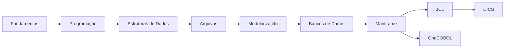

<h1 class="page-title">
  <svg class="title-icon" viewBox="0 0 24 24" fill="none" stroke="currentColor" stroke-width="1.8" stroke-linecap="round" stroke-linejoin="round" aria-hidden="true">
    <path d="M4 6h16M4 12h16M4 18h10"/>
    <path d="M17 15l3 3-3 3"/>
  </svg>
  COBOL
</h1>

---

## Introdução

COBOL (*Common Business-Oriented Language*) é uma linguagem de programação voltada principalmente para processamento de dados e sistemas de negócio.

A linguagem possui forte presença em ambientes corporativos, especialmente em sistemas de grande porte, instituições financeiras, seguradoras, empresas de serviços e ambientes mainframe.

Esta seção apresenta os fundamentos da linguagem e avança gradualmente para arquivos, bancos de dados, JCL, z/OS, CICS e outros componentes comuns do ecossistema COBOL.

O objetivo é construir uma base sólida antes de avançar para ambientes corporativos e mainframe.

---

## Conteúdo

Siga esta sequência para compreender COBOL desde os fundamentos da linguagem até os principais componentes encontrados em ambientes mainframe.

<div class="wiki-topic-list">

  <a class="wiki-topic" href="{{ 'cobol/fundamentos/index.html' | relative_url }}">
    <span class="wiki-topic-title">Fundamentos</span>
    <span class="wiki-topic-description">História, características, estrutura de programas, divisões, sintaxe e regras básicas do COBOL.</span>
  </a>

  <a class="wiki-topic" href="{{ 'cobol/programacao/index.html' | relative_url }}">
    <span class="wiki-topic-title">Programação</span>
    <span class="wiki-topic-description">Variáveis, operações, condições, loops, PERFORM, procedimentos e controle de fluxo.</span>
  </a>

  <a class="wiki-topic" href="{{ 'cobol/estruturas-dados/index.html' | relative_url }}">
    <span class="wiki-topic-title">Estruturas de Dados</span>
    <span class="wiki-topic-description">Grupos de dados, PIC, OCCURS, REDEFINES, tabelas e estruturas utilizadas em COBOL.</span>
  </a>

  <a class="wiki-topic" href="{{ 'cobol/arquivos/index.html' | relative_url }}">
    <span class="wiki-topic-title">Arquivos</span>
    <span class="wiki-topic-description">Arquivos sequenciais e indexados, operações de leitura e escrita, FILE STATUS e VSAM.</span>
  </a>

  <a class="wiki-topic" href="{{ 'cobol/modularizacao/index.html' | relative_url }}">
    <span class="wiki-topic-title">Modularização</span>
    <span class="wiki-topic-description">Procedures, Sections, Paragraphs, subprogramas, CALL, parâmetros e COPYBOOKs.</span>
  </a>

  <a class="wiki-topic" href="{{ 'cobol/bancos-dados/index.html' | relative_url }}">
    <span class="wiki-topic-title">Bancos de Dados</span>
    <span class="wiki-topic-description">Integração entre COBOL e bancos de dados, Embedded SQL, SQL e DB2.</span>
  </a>

  <a class="wiki-topic" href="{{ 'cobol/mainframe/index.html' | relative_url }}">
    <span class="wiki-topic-title">Mainframe</span>
    <span class="wiki-topic-description">Conceitos de mainframe, z/OS, TSO, ISPF, datasets, jobs e SDSF.</span>
  </a>

  <a class="wiki-topic" href="{{ 'cobol/jcl/index.html' | relative_url }}">
    <span class="wiki-topic-title">JCL</span>
    <span class="wiki-topic-description">Job Control Language, execução de programas, datasets, parâmetros e processamento em batch.</span>
  </a>

  <a class="wiki-topic" href="{{ 'cobol/cics/index.html' | relative_url }}">
    <span class="wiki-topic-title">CICS</span>
    <span class="wiki-topic-description">Processamento transacional, programas COBOL, transações, COMMAREA, canais e containers.</span>
  </a>

  <a class="wiki-topic" href="{{ 'cobol/gnucobol/index.html' | relative_url }}">
    <span class="wiki-topic-title">GnuCOBOL</span>
    <span class="wiki-topic-description">Instalação, compilação, execução e desenvolvimento de programas COBOL em ambientes modernos.</span>
  </a>

  <a class="wiki-topic" href="{{ 'cobol/exercicios/index.html' | relative_url }}">
    <span class="wiki-topic-title">Exercícios</span>
    <span class="wiki-topic-description">Exercícios progressivos para praticar sintaxe, lógica, arquivos e integração com outros componentes.</span>
  </a>

</div>

---

O fluxo de estudo pode ser resumido assim:



---

## Ambiente de estudo

Para começar a praticar COBOL, é possível utilizar ambientes locais como o GnuCOBOL.

Uma abordagem inicial pode ser:

```text
Código COBOL
↓
Compilação
↓
Execução
↓
Teste
↓
Correção
↓
Nova execução
```

Depois dos fundamentos, o estudo pode avançar para ambientes mais próximos dos utilizados em sistemas corporativos:

```text
COBOL
↓
Arquivos
↓
SQL
↓
DB2
↓
JCL
↓
z/OS
↓
CICS
```

---

## Boas práticas

- Comece pela sintaxe e estrutura dos programas antes de avançar para mainframe.
- Pratique cada conceito com pequenos programas.
- Entenda a estrutura dos dados antes de trabalhar com arquivos e bancos de dados.
- Utilize ambientes de laboratório para executar os exemplos.
- Documente os programas e explique a finalidade de cada divisão.
- Aprenda a interpretar mensagens de compilação e execução.
- Depois dos fundamentos, estude JCL, z/OS, DB2 e CICS.
- Mantenha os exercícios organizados por nível de dificuldade.

---

## Materiais de estudo

Os materiais desta seção serão organizados conforme a evolução da documentação.

<div class="wiki-topic-list">

  <a class="wiki-topic" href="{{ 'cobol/materiais/index.html' | relative_url }}">
    <span class="wiki-topic-title">Materiais de Estudo</span>
    <span class="wiki-topic-description">Cursos, documentação, livros, referências técnicas, laboratórios e outros materiais relacionados a COBOL.</span>
  </a>

</div>

---

> Esta seção reúne conceitos, exemplos, procedimentos e materiais de estudo relacionados a COBOL, desde os fundamentos da linguagem até tecnologias utilizadas em ambientes corporativos e mainframe.