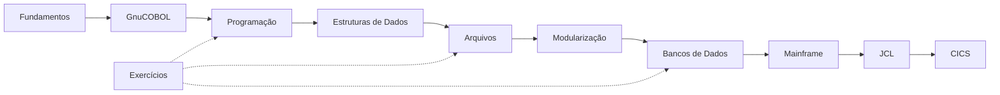

<h1 class="page-title">
  <svg class="title-icon" viewBox="0 0 24 24" fill="none" stroke="currentColor" stroke-width="1.8" stroke-linecap="round" stroke-linejoin="round" aria-hidden="true">
    <path d="M4 6h16M4 12h16M4 18h10"/>
    <path d="M17 15l3 3-3 3"/>
  </svg>
  COBOL
</h1>

> Do primeiro programa ao ambiente mainframe: conceitos, exemplos, exercícios e materiais de estudo sobre COBOL.

---

## Introdução

COBOL (*Common Business-Oriented Language*) é uma linguagem criada em 1959 e voltada ao processamento de dados e a sistemas de negócio. Mais de seis décadas depois, continua em produção em bancos, seguradoras, órgãos públicos e empresas de serviços, principalmente em ambientes mainframe, onde processa grandes volumes de transações todos os dias.

Esta seção começa pelos fundamentos da linguagem e avança de forma gradual até arquivos, bancos de dados, JCL, z/OS e CICS. A ideia é construir uma base sólida antes de entrar nos ambientes corporativos.

### Para quem é

- Estudantes e iniciantes que querem aprender COBOL do zero.
- Profissionais de outras linguagens que precisam atuar em sistemas legados ou mainframe.
- Quem busca uma referência organizada para revisar conceitos.

### Pré-requisitos

Não é necessário conhecer COBOL. Ajuda ter noções básicas de lógica de programação (variáveis, condições e repetições) e familiaridade com o terminal.

---

## Conteúdo

Siga a sequência abaixo para estudar COBOL dos fundamentos até os componentes típicos de ambientes mainframe.

<div class="wiki-topic-list">

  <a class="wiki-topic" href="{{ 'cobol/fundamentos/index.html' | relative_url }}">
    <span class="wiki-topic-title">1. Fundamentos</span>
    <span class="wiki-topic-description">História, características, estrutura de programas, divisões, sintaxe e regras básicas do COBOL.</span>
  </a>

  <a class="wiki-topic" href="{{ 'cobol/gnucobol/index.html' | relative_url }}">
    <span class="wiki-topic-title">2. GnuCOBOL</span>
    <span class="wiki-topic-description">Instalação, compilação, execução e desenvolvimento de programas COBOL em ambientes modernos. Seu laboratório para praticar desde o início.</span>
  </a>

  <a class="wiki-topic" href="{{ 'cobol/programacao/index.html' | relative_url }}">
    <span class="wiki-topic-title">3. Programação</span>
    <span class="wiki-topic-description">Variáveis, operações, condições, loops, PERFORM, procedimentos e controle de fluxo.</span>
  </a>

  <a class="wiki-topic" href="{{ 'cobol/estruturas-dados/index.html' | relative_url }}">
    <span class="wiki-topic-title">4. Estruturas de Dados</span>
    <span class="wiki-topic-description">Grupos de dados, PIC, OCCURS, REDEFINES, tabelas e demais estruturas usadas em COBOL.</span>
  </a>

  <a class="wiki-topic" href="{{ 'cobol/arquivos/index.html' | relative_url }}">
    <span class="wiki-topic-title">5. Arquivos</span>
    <span class="wiki-topic-description">Arquivos sequenciais e indexados, operações de leitura e escrita, FILE STATUS e VSAM.</span>
  </a>

  <a class="wiki-topic" href="{{ 'cobol/modularizacao/index.html' | relative_url }}">
    <span class="wiki-topic-title">6. Modularização</span>
    <span class="wiki-topic-description">Sections, Paragraphs, subprogramas, CALL, passagem de parâmetros e COPYBOOKs.</span>
  </a>

  <a class="wiki-topic" href="{{ 'cobol/bancos-dados/index.html' | relative_url }}">
    <span class="wiki-topic-title">7. Bancos de Dados</span>
    <span class="wiki-topic-description">Integração entre COBOL e bancos de dados: Embedded SQL, SQL e DB2.</span>
  </a>

  <a class="wiki-topic" href="{{ 'cobol/mainframe/index.html' | relative_url }}">
    <span class="wiki-topic-title">8. Mainframe</span>
    <span class="wiki-topic-description">Conceitos de mainframe, z/OS, TSO, ISPF, datasets, jobs e SDSF.</span>
  </a>

  <a class="wiki-topic" href="{{ 'cobol/jcl/index.html' | relative_url }}">
    <span class="wiki-topic-title">9. JCL</span>
    <span class="wiki-topic-description">Job Control Language: execução de programas, datasets, parâmetros e processamento em batch.</span>
  </a>

  <a class="wiki-topic" href="{{ 'cobol/cics/index.html' | relative_url }}">
    <span class="wiki-topic-title">10. CICS</span>
    <span class="wiki-topic-description">Processamento transacional, programas COBOL, transações, COMMAREA, canais e containers.</span>
  </a>

  <a class="wiki-topic" href="{{ 'cobol/exercicios/index.html' | relative_url }}">
    <span class="wiki-topic-title">Exercícios</span>
    <span class="wiki-topic-description">Exercícios progressivos para praticar sintaxe, lógica, arquivos e integração com outros componentes. Podem ser feitos em paralelo a cada etapa.</span>
  </a>

</div>

---

## Trilha de estudo

O GnuCOBOL entra logo depois dos fundamentos para que você possa executar os exemplos desde cedo. Os exercícios acompanham todas as etapas.



---

## Primeiro contato

Um programa COBOL mínimo, para conhecer o formato antes de entrar nos detalhes:

```cobol
       IDENTIFICATION DIVISION.
       PROGRAM-ID. HELLO.

       PROCEDURE DIVISION.
           DISPLAY "Olá, COBOL!".
           STOP RUN.
```

Cada programa é organizado em **divisões** (`IDENTIFICATION`, `ENVIRONMENT`, `DATA` e `PROCEDURE`). Elas são explicadas em detalhe em [Fundamentos]({{ 'cobol/fundamentos/index.html' | relative_url }}).

---

## Ambiente de estudo

Para praticar, use um ambiente local como o GnuCOBOL. O ciclo básico de trabalho é:

```text
Código COBOL
↓
Compilação
↓
Execução
↓
Teste
↓
Correção
↓
Nova execução
```

Depois dos fundamentos, o estudo avança para ambientes mais próximos dos usados em sistemas corporativos:

```text
COBOL
↓
Arquivos
↓
SQL
↓
DB2
↓
JCL
↓
z/OS
↓
CICS
```

---

## Boas práticas de estudo

- Comece pela sintaxe e pela estrutura dos programas antes de avançar para mainframe.
- Pratique cada conceito com pequenos programas.
- Entenda a estrutura dos dados antes de trabalhar com arquivos e bancos de dados.
- Execute todos os exemplos em um ambiente de laboratório, sem apenas ler o código.
- Documente os programas e explique a finalidade de cada divisão.
- Aprenda a interpretar mensagens de compilação e execução.
- Estude JCL, z/OS, DB2 e CICS somente depois de dominar os fundamentos.
- Organize os exercícios por nível de dificuldade e revise-os periodicamente.

---

## Materiais de estudo

Os materiais desta seção serão organizados conforme a evolução da documentação.

<div class="wiki-topic-list">

  <a class="wiki-topic" href="{{ 'cobol/materiais/index.html' | relative_url }}">
    <span class="wiki-topic-title">Materiais de Estudo</span>
    <span class="wiki-topic-description">Cursos, documentação, livros, referências técnicas, laboratórios e outros materiais relacionados a COBOL.</span>
  </a>

</div>

---

> Esta seção reúne conceitos, exemplos, procedimentos e materiais de estudo sobre COBOL, dos fundamentos da linguagem às tecnologias usadas em ambientes corporativos e mainframe.